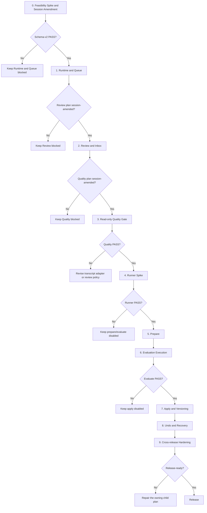

# Skill Evolver Implementation Roadmap

**Purpose:** Turn `skill-evolver/docs/superpowers/specs/2026-07-26-skill-evolver-design.md`
plus the approved
`skill-evolver/docs/superpowers/specs/2026-07-28-skill-evolver-session-capture-amendment-design.md`
into a gate-driven sequence of independently executable implementation plans.

**Roadmap status:** Defined. A document existing does not mean its release gate
has passed or that its implementation is authorized.

**Execution model:** Run exactly one child plan at a time. Preserve the
artifacts and completion report from that plan, evaluate its exit gate, and
only then enter the next child plan. A failed gate routes to a corrective design
amendment; it never authorizes skipping ahead.

## Global Constraints

- Supported production surfaces are macOS Codex CLI and Desktop.
- Runtime is exactly `/usr/bin/python3` version 3.9 or newer.
- Runtime dependencies are limited to the Python standard library and SQLite
  through `sqlite3`.
- The plugin uses one trusted matcher-free `Stop` command Hook.
- The Hook performs no model call, transcript analysis, network access, or
  user-facing chat output.
- `$skill-evolver` runs only when the user explicitly names it or explicitly
  asks to manage the improvement inbox.
- An argument-free `$skill-evolver` invocation is status-only and does not read
  transcripts or import the spool.
- Installed skills are not changed before the Apply release.
- Evaluation never changes the installed skill.
- Actual apply, purge, and undo executors default to `manual_terminal`, require
  a TTY, and require the complete bound digest or current hash.
- PostgreSQL, a background worker, scheduled review, external services, a web
  UI, automatic evaluation, automatic apply, Git commit, push, and pull-request
  creation are outside this roadmap.
- Every child plan inherits the security, privacy, retention, concurrency, and
  completion requirements of the base design plus approved session amendment.

## Document Roles

- This roadmap defines ordering, inputs, outputs, and go/no-go routing.
- Each child document is a detailed implementation plan with exact file paths,
  interfaces, tests, commands, expected results, and commit boundaries.
- The source design remains the normative product and security specification.
- A child plan may tighten a safety condition but may not weaken a source-design
  gate without a separately reviewed design amendment.

## Plan Sequence

| Order | Release | Plan | Entry gate | Exit artifact |
| ---: | --- | --- | --- | --- |
| 0 | Feasibility | `2026-07-26-skill-evolver-feasibility-spike.md` plus `2026-07-28-skill-evolver-session-capture-amendment.md` | Base design and session amendment approved | `skill-evolver/docs/feasibility-report-v2.json` |
| 1 | Read-only MVP | `2026-07-28-skill-evolver-session-runtime-queue.md` | `feasibility-report-v2.json` has schema `2`, decision `PASS`, and next action `write_session_runtime_queue_plan` | production session capture, SQLite schema v1, queue/status integration report |
| 2 | Read-only MVP | `2026-07-26-skill-evolver-read-only-review-inbox.md` after a session-contract rewrite | Runtime/queue integration suite passes and the Review plan consumes generations rather than turn rows | manual review and candidate-inbox report |
| 3 | Read-only MVP | `2026-07-26-skill-evolver-read-only-quality-gate.md` after a session-evidence rewrite | Review/inbox suite passes with zero target-skill writes and the Quality plan counts independent sessions rather than turns or generations | immutable Read-only quality report |
| 4 | Evaluate | `2026-07-26-skill-evolver-evaluate-runner-spike.md` | Read-only quality decision is `PASS` | pinned runner contract and reproducible probe report |
| 5 | Evaluate | `2026-07-26-skill-evolver-evaluate-prepare.md` | Runner spike decision is `PASS` | immutable base, candidate, harness, diff, and evaluation spec |
| 6 | Evaluate | `2026-07-26-skill-evolver-evaluate-execution.md` | Prepare artifacts pass digest and immutability checks | evaluation report bound to the full spec digest |
| 7 | Apply | `2026-07-26-skill-evolver-apply-versioning.md` | Evaluate release completion gate passes | manual apply executor, durable journal, version lineage |
| 8 | Apply | `2026-07-26-skill-evolver-undo-recovery.md` | Apply transaction suite passes without enabling agent apply | hash-bound undo and crash-recovery report |
| 9 | Cross-release | `2026-07-26-skill-evolver-hardening.md` | All preceding plans pass their local gates | `skill-evolver/docs/release-reports/hardening.json` |

## Dependency and Failure Routing



Failure routes have these fixed meanings:

- A missing or failing schema-v2 report keeps Runtime/Queue blocked. The
  approved session amendment and a fresh immutable report must resolve the
  gate; the superseded turn-level Runtime Queue plan is never executed.
- An unamended Review or Quality plan stays blocked. Both executable plans must
  consume session generations while counting distinct `session_key` values—not
  turns or later generations—as independent evidence.
- Read-only quality failure returns to the transcript adapter or improvement
  policy. It does not activate runner, prepare, or evaluate commands.
- Runner failure leaves `prepare` and `evaluate` unavailable in the installed
  skill and records the unsupported contract.
- Evaluation failure leaves the candidate and installed target unchanged and
  does not activate apply.
- Apply or undo recovery ambiguity stops file mutation, preserves journal and
  sibling paths, and reports `recovery_required`.

## Stable Repository Layout

The Feasibility plan first creates the plugin tree. Later plans evolve that
same tree into production code:

```text
skill-evolver/
├── .codex-plugin/
│   └── plugin.json
├── hooks/
│   └── hooks.json
├── docs/
│   ├── feasibility-report.json
│   ├── feasibility-report.md
│   ├── feasibility-report-v2.json
│   ├── feasibility-report-v2.md
│   └── release-reports/
└── skills/
    └── skill-evolver/
        ├── SKILL.md
        ├── references/
        │   ├── improvement-policy.md
        │   └── runtime.json
        ├── scripts/
        │   └── evolver.py
        ├── evals/
        │   └── evals.json
        └── tests/
            ├── feasibility_probe.py
            ├── fixtures/
            ├── support.py
            ├── test_installation.py
            ├── test_capture.py
            ├── test_review.py
            ├── test_quality_gate.py
            ├── test_runner_probe.py
            ├── test_prepare.py
            ├── test_evaluate.py
            ├── test_apply.py
            ├── test_undo_recovery.py
            └── test_hardening.py
```

`evolver.py` remains a self-contained standard-library entrypoint because
isolated mode (`python -I`) does not provide sibling runtime imports. Test files
are split by release responsibility, but production commands share that
entrypoint and its validated installation locator.

## Runtime Data and Schema Evolution

The canonical private data root remains outside the plugin cache:

```text
skill-evolver/
├── installation.json
├── config.json
├── identity.key
├── evolver.db
├── spool/
├── staging/
├── snapshots/
└── reports/
```

Database migrations are release-bound:

| Schema version | Owning plan | Tables and columns activated |
| ---: | --- | --- |
| 1 | Runtime/Queue | `review_batches`, one `review_items` row per `session_key` with generation/epoch/observed/reviewed/frozen state, `candidates`, session-unique `candidate_evidence`, and `metadata`; no `ready_evaluation_id` |
| 2 | Evaluate/Prepare | `evaluations` and nullable `candidates.ready_evaluation_id` |
| 3 | Apply/Versioning | `apply_operations`, `versions`, apply/undo indexes |

Opening the database always enables foreign keys, confirms WAL mode, checks the
exact schema version, and fails closed for an unknown newer version or failed
migration.

## Cross-Plan Interface Contracts

### Feasibility → Runtime/Queue

The Runtime/Queue plan consumes the following exact authoritative fields from
`skill-evolver/docs/feasibility-report-v2.json`:

- `schema_version: 2`
- `decision: "PASS"`
- `next_action: "write_session_runtime_queue_plan"`
- predecessor path `docs/feasibility-report.json` with SHA-256
  `ced4503adb44bd041de063c04e0c6c64d0831370fc12e96a920fe97244d8ae15`
- six `true` checks: CLI/Desktop `session_stop_contract`,
  `asymmetric_access`, and `session_transcript_supported`
- CLI and Desktop `stop_keys` exactly
  `["cwd", "hook_event_name", "session_id", "transcript_path"]`
- CLI and Desktop `binding_modes` exactly `["same_file_identity"]`
- CLI and Desktop `session_id_pointer_paths` exactly
  `["/payload/session_id"]`
- CLI and Desktop `provenance_pointer_paths` exactly `["/payload/role"]`

The access fixtures additionally bind the asymmetric runtime contract: the
Hook reads and writes the fixed global root, ordinary skill execution reads it
but cannot write it by default, and each review or maintenance mutation needs
explicit approval scoped to the exact command and root. Implementers do not
guess fields, require `turn_id`, grant a persistent writable root, or broaden
filesystem access if any exact value is absent.

### Runtime/Queue → Review/Inbox

The capture plan produces:

- validated `installation.json`, `config.json`, and `identity.key`
- SQLite schema version 1 with one `review_items` row per HMAC
  `session_key`
- optional diagnostic `turn_id`, never used as a key or transcript boundary
- session generation, `transcript_epoch`, observed, reviewed, and
  lease-frozen boundary state
- Stop upsert, atomic bounded spool fallback, and explicit scoped maintenance
- session-based retention/capacity primitives and transcript-free read-only
  status
- candidate evidence uniqueness by candidate fingerprint, `session_key`, and
  signal type

The Review/Inbox plan must be rewritten to use these records before execution.
It must not introduce another queue, require a turn span, count another
generation as independent evidence, or copy transcript bodies into SQLite.

### Review/Inbox → Read-only Quality Gate

The review plan produces:

- lease-bound review batches
- a fail-closed transcript adapter
- allowlisted target identities
- validated structured model-result JSON
- deterministic exclusion codes, fingerprints, evidence merging, defer, reject,
  and inspect behavior
- at most one candidate per session and three new candidates per batch

Before execution, the Quality plan must be rewritten to measure independent
sessions by distinct `session_key`. It must not use a turn count or count later
generations of the same session as additional evidence. After that contract
rewrite, it measures these exact outputs and does not alter results to make the
gate pass.

### Read-only Quality Gate → Evaluate Runner

The immutable quality report records:

- reviewed independent-session counts; later generations of one session do not
  increase independent evidence
- user-marked evaluation-worth count
- target-skill attribution errors
- external-content adoption incidents
- the exact review policy and transcript adapter digests

Evaluate work starts only when at least 10 independent sessions were reviewed,
evaluation-worth rate is at least 50%, target-skill misattribution is at most
20%, and external-content adoption incidents equal zero.

### Runner → Prepare → Evaluate

The runner spike fixes:

- runner kind, executable path, exact version, and supported result schema
- model ID and evaluation parameters
- temporary Codex home and credential policy
- read-only base/candidate inputs and one writable output root
- tool, network, process, time, memory, and disk policies
- deterministic failure mapping for timeout, crash, schema, and sandbox errors

Prepare hashes that contract into every evaluation spec. Evaluation runs only
the exact immutable spec digest shown to the user.

### Evaluate → Apply → Undo

Apply consumes the candidate's `ready_evaluation_id`, full evaluation spec
digest, report digest, base/candidate manifests, and current target hash.
Versioning records the resulting content and parent hashes. Undo consumes a
specific version event and an exact expected-current hash; it restores the
parent snapshot, not an ambiguous version label.

## Release Gates

### Feasibility gate

- `feasibility-report-v2.json` has the exact schema, decision, next action,
  predecessor digest, checks, and surface fields listed in the upstream
  interface contract.
- Two independent real sessions exist for CLI and Desktop, with stable
  session/provenance pointers and no required turn span.
- The frozen session prefix is complete and does not read past its captured
  boundary.
- Hook read/write, default skill read plus write denial, and explicit scoped
  skill write all pass on both surfaces.

### Read-only gate

- Hook capture is idempotent and silent.
- Status does not read transcripts or mutate the spool.
- Review respects the 5-session, 2-MiB-per-session, 100-record, and
  8-MiB-per-batch limits.
- No installed skill, staging tree, or snapshot is modified.
- The quality thresholds in the preceding interface contract pass.

### Evaluate gate

- Prepare executes no candidate content.
- Runner contract passes with pinned binary/version and fail-closed resource
  enforcement.
- Base, candidate, harness, runner, model, sandbox, and result schema are bound
  by one canonical evaluation spec digest.
- Evaluation leaves the installed target hash unchanged.

### Apply gate

- Chat produces preview and an exact manual-terminal command only.
- Executor requires a TTY and the complete digest.
- Target lock, drift check, capacity check, snapshot, journal, same-filesystem
  swap, post-apply validation, and rollback all pass.
- Undo requires the complete expected-current hash and uses the same durable
  transaction and recovery machinery.

### Final hardening gate

- Deterministic suites, probabilistic behavior evaluations, prompt-injection
  fixtures, fault-injection matrix, and long-running capture/review soak pass.
- No gate weakens manual approval, immutable artifacts, data minimization, or
  fail-closed path and digest validation.

## Source-Spec Coverage

| Source design sections | Owning child plans |
| --- | --- |
| 1–6: goals, non-goals, decisions, delivery gates, terminology | Roadmap and every child plan |
| 7.2–8: plugin, data root, Stop Hook | Feasibility and Runtime/Queue |
| 9, 10, 11.1: intents, status, review, inspect | Review/Inbox |
| 11.2, 12.1–12.2: approval split, prepare, manifests | Evaluate/Prepare |
| 12.3–12.5: runner and evaluation | Runner Spike and Evaluation Execution |
| 13: apply, version, undo | Apply/Versioning and Undo/Recovery |
| 14–15: states and release migrations | Runtime/Queue, Review/Inbox, Evaluate/Prepare, Apply/Versioning |
| 16–19: retention, configuration, security, concurrency | Runtime/Queue, Quality Gate, every mutating plan |
| 20–22: tests, operations, completion | Quality Gate and Hardening |
| 23: implementation order | This roadmap |
| 24–25: rejected alternatives and official constraints | Global constraints and every child plan |

## Execution Record

Each child plan owns one immutable completion report under
`skill-evolver/docs/release-reports/` or the more specific path named by that
plan. No additional central workflow database or roadmap-state file is added.

Do not hand-edit a gate from FAIL to PASS. A rerun creates a new report that
refers to the repair commit and supersedes the earlier report by digest. The
next plan checks the exact upstream report named in its entry gate.
