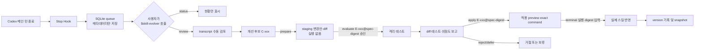
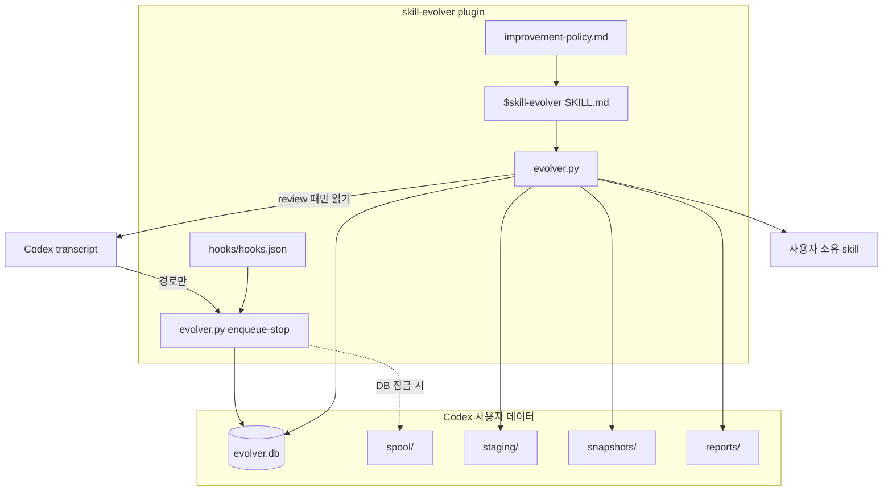
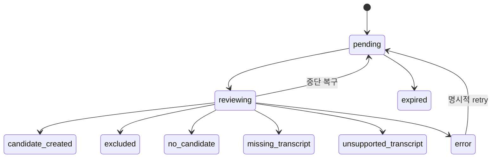
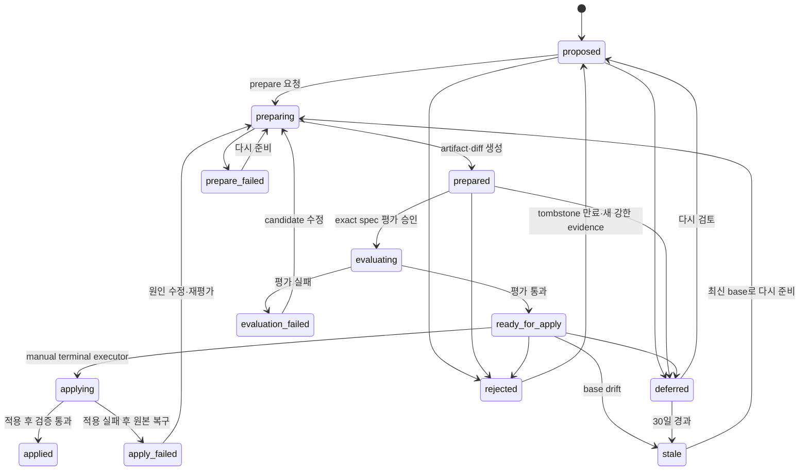

# Skill Evolver 설계

- 상태: 검토 요청
- 작성일: 2026-07-26
- 대상: 개인용 Codex 스킬 및 플러그인
- 범위: Stop Hook 기반 관찰, 수동 개선 후보 검토, 검증된 변경의 승인 적용

## 1. 요약

Skill Evolver는 Codex 작업 기록에서 반복 가능한 스킬 개선점을 찾고, 사용자가 검토와 적용을 통제하는 로컬 개선 루프다.

핵심 구조는 다음과 같다.

1. 중앙 `Stop` Hook이 허용된 작업공간의 메인 턴 종료를 queue에 기록한다.
2. Hook은 모델을 호출하거나 transcript를 분석하지 않고 메타데이터만 저장한다.
3. 사용자가 `$skill-evolver`를 명시적으로 호출하면 queue 상태를 확인한다.
4. 사용자가 `review`를 요청한 경우에만 transcript를 읽어 개선 후보를 만든다.
5. 사용자가 `prepare`를 요청하면 실행 없이 staging 변경안과 diff를 만든다.
6. 사용자가 정확한 evaluation spec digest를 지정해 `evaluate`한 뒤 격리된 환경에서 검증한다.
7. 검증 결과를 본 사용자가 같은 digest의 적용 preview를 요청하고, Codex 밖의 terminal에서 exact executor command를 직접 실행해야 실제 스킬을 변경한다.
8. 적용 전후 전체 스킬 hash와 snapshot을 남기며, 실패하면 자동으로 원본을 복구한다.

이 설계는 Hermes Agent의 자가 개선 아이디어를 가져오되, 자동 수정과 자동 적용은 제외한다. 학습 신호의 수집은 자동화하고 판단과 변경 권한은 사용자에게 남기는 것이 목적이다.



## 2. 배경과 문제

현재 스킬 개선은 대체로 사용자가 실패를 기억하고 해당 `SKILL.md`를 직접 수정하는 방식이다. 이 방식에는 다음 문제가 있다.

- 사용자 교정이나 검증 실패가 여러 세션에 흩어진다.
- 어떤 문제가 프로젝트 환경 때문인지 스킬 지침 때문인지 구분하기 어렵다.
- 한 번뿐인 예외를 일반 규칙으로 굳혀 스킬이 과적합될 수 있다.
- 개선안을 바로 원본에 적용하면 회귀 여부를 확인하기 어렵다.
- 모든 스킬에 회고 규칙을 넣으면 중복되고 누락되며 유지보수가 어렵다.
- 완전 자동 적용은 transcript의 외부 지시나 잘못된 원인 분석을 스킬에 영구 반영할 위험이 있다.

따라서 관찰은 중앙 Hook으로 통합하고, 의미 분석과 변경은 명시적인 사용자 호출 뒤에만 수행한다.

## 3. 목표

### 3.1 기능 목표

- 허용된 작업공간의 메인 턴 종료를 빠르고 중복 없이 기록한다.
- 사용자 교정, 불필요한 재작업, 검증 실패를 스킬 개선 신호로 분류한다.
- 환경 문제와 스킬 지침 문제를 분리한다.
- 여러 세션에서 반복된 동일 문제를 하나의 후보로 병합한다.
- 후보별 근거, 대상 스킬, 제안 변경, 검증 방법과 위험도를 제시한다.
- 원본을 변경하지 않고 old-versus-candidate 평가를 수행한다.
- 명시적인 적용 승인 뒤에만 사용자 소유 스킬을 변경한다.
- 적용 실패, 원본 drift, 중단 상황에서 안전하게 복구한다.
- queue와 후보가 쌓여도 보존 기간, 중복 제거, 상한선으로 관리한다.

### 3.2 운영 목표

- 일반 작업 종료 시 채팅에 회고 메시지를 추가하지 않는다.
- Stop Hook 실행에는 모델 호출과 네트워크 접근이 없어야 한다.
- Python 표준 라이브러리와 SQLite만 사용한다.
- transcript 본문을 별도 데이터베이스에 복제하지 않는다.
- 설치된 모든 스킬을 무조건 수정 대상으로 간주하지 않는다.

## 4. 비목표

최소 기능 제품(Minimum Viable Product, MVP)에서는 다음을 구현하지 않는다.

- 백그라운드 worker 또는 예약된 자동 검토
- 후보의 자동 평가
- 실제 스킬의 자동 수정 또는 자동 적용
- Git commit, push 또는 pull request(PR)의 자동 생성
- 현재 Codex 서비스 외의 별도 third-party 서버로 transcript나 후보 전송
- 여러 사용자가 공유하는 중앙 학습 시스템
- 웹 UI나 별도 대시보드
- 모든 Codex 대화를 기본 수집하는 전역 감시
- transcript 내부 지시를 실행하는 에이전트
- 모델 기반 실시간 Stop Hook

## 5. 핵심 설계 결정

| 영역 | 결정 |
| --- | --- |
| 관찰 위치 | 각 스킬이 아니라 중앙 플러그인의 `Stop` Hook |
| Hook 역할 | 메타데이터 적재만 수행 |
| 검토 트리거 | 사용자가 `$skill-evolver review`를 명시적으로 호출 |
| 기본 호출 | `$skill-evolver`는 상태만 표시 |
| 저장소 | Python `sqlite3` 기반 로컬 SQLite |
| transcript 저장 | 원문 복사 없이 Codex transcript 경로만 저장 |
| 후보 생성 | 세션당 최대 1개, 검토 batch당 신규 최대 3개 |
| 승인 모델 | 실행 없는 `prepare` 뒤 `evaluate`와 `apply`를 분리한 2단계 승인 |
| 평가 위치 | 원본이 아닌 candidate staging 디렉터리 |
| 버전 식별 | 전체 스킬 디렉터리의 content hash |
| 복구 | 적용 전 snapshot, 적용 후 검증 실패 시 원본 복구 |
| 자동화 수준 | 적재만 자동, 판단·평가·적용은 수동 |

### 5.1 전달 단계와 go/no-go

이 문서의 전체 구조를 한 번에 MVP로 구현하지 않는다.

1. **Feasibility spike**
   - 실제 Codex CLI와 Desktop의 `Stop` payload fixture를 수집한다.
   - Hook과 `$skill-evolver`가 같은 데이터 루트를 읽고 쓸 수 있는지 확인한다.
   - transcript prefix에서 `turn_id`와 source provenance를 안정적으로 복원할 수 있는지 확인한다.

2. **Read-only MVP**
   - Stop Hook, queue, retention, status, review, inspect, defer, reject와 privacy purge까지만 구현한다.
   - 설치된 스킬, staging 또는 snapshot을 변경하지 않는다.
   - 최소 10개 세션 또는 30개 턴을 검토해 candidate 품질을 측정한다.

3. **Evaluate release**
   - 사용자가 candidate diff를 먼저 보는 `prepare`를 추가한다.
   - pinned CLI/App Server runner spike를 먼저 통과한다.
   - 격리된 old-versus-candidate behavior evaluation을 추가한다.

4. **Apply release**
   - 정확한 evaluation spec digest를 지정하는 수동 적용과 현재 hash에 묶인 undo를 추가한다.
   - crash recovery와 fault-injection 검증을 통과한 뒤에만 활성화한다.

Read-only MVP에서 제안된 candidate 중 사용자가 평가할 가치가 있다고 판단한 비율이 50% 미만이거나, target skill 오귀속이 20%를 넘거나, 외부 콘텐츠를 개선 신호로 채택한 사례가 하나라도 있으면 Evaluate release로 진행하지 않는다. review policy와 transcript adapter를 먼저 수정한다.

## 6. 용어

- **review item**: 하나의 `Stop` 이벤트로 생성된 검토 대상 턴
- **review batch**: 한 번의 `$skill-evolver review`에서 처리한 세션과 턴 묶음
- **candidate**: 일반화 가능하다고 판단된 스킬 개선 제안
- **evidence**: candidate를 뒷받침하는 사용자 교정, 검증 실패 또는 재작업 요약
- **evaluation**: 원본과 candidate를 독립적으로 실행해 변경 효과를 확인하는 과정
- **base hash**: `prepare`가 만든 immutable base artifact 전체의 hash
- **candidate hash**: staging에서 평가한 변경본 전체의 hash
- **evaluation spec digest**: base·candidate·harness·runner·model·sandbox·resource 정책을 묶은 immutable 평가 사양의 hash
- **drift**: 평가 이후 원본 스킬의 hash가 달라진 상태
- **tombstone**: 거절된 동일 후보가 즉시 다시 제안되지 않도록 남기는 fingerprint 기록
- **conflict group**: 같은 문제에 대해 서로 양립할 수 없는 제안을 묶는 식별자

## 7. 시스템 구조

### 7.1 컴포넌트



책임은 deterministic runtime과 현재 Codex 모델로 분리한다.

| 주체 | 책임 | 하지 않는 일 |
| --- | --- | --- |
| Hook·Python CLI | path 검증, queue, lease, state transition, hash, manifest, snapshot, report 저장 | transcript 의미 판단, candidate 작성 |
| 현재 Codex 모델 | 선택된 transcript 분석, attribution, candidate와 patch 초안 작성 | 승인 상태 위조, 직접 DB state 변경 |
| 평가 subagent | 명시적으로 제공된 old/candidate 경로와 immutable rubric으로 behavior 실행 | 실제 사용자 스킬 변경 |
| 사용자 | review, prepare, evaluate, apply/undo 의사결정 | 자동 승인 위임 |

모델이 생성하는 review 결과는 구조화된 JSON으로 Python CLI에 전달한다. CLI는 enum, 문자열 길이, candidate 상한, target identity와 허용 root를 다시 검증한 뒤에만 DB에 commit한다. 모델이 제안한 경로는 사용하지 않고, `target_identity`를 설치 시 만든 allowlisted skill catalog에서 다시 해석한다.

```json
{
  "schema_version": 1,
  "review_item_ids": [12, 13],
  "decision": "candidate",
  "target": {
    "identity": "user-skill:verification-before-completion",
    "display_name": "verification-before-completion"
  },
  "classification": {
    "problem_category": "verification",
    "target_locator": "completion-claim behavior",
    "proposal_intent": "add-failed-check-guard"
  },
  "problem_summary": "검증 실패 뒤 완료 선언이 가능함",
  "proposal_summary": "완료 선언 전에 실패한 검증 결과를 확인",
  "validation_plan": "관찰 재현 1개, 회귀 3개, holdout 2개",
  "risk_level": "low",
  "evidence": [
    {
      "review_item_id": 12,
      "source_kind": "user_direct",
      "signal_type": "explicit_correction",
      "summary": "사용자가 검증 실패 후 완료 선언을 교정함"
    }
  ]
}
```

`review_item_ids`와 각 evidence의 `review_item_id`는 현재 lease한 item이어야 한다. `problem_category`, `target_locator`, `proposal_intent`는 fingerprint 입력이며 Python이 Unicode 정규화, case folding과 공백 정리를 적용한다. 빈 값, 알 수 없는 target identity, batch 밖 item 또는 서로 일치하지 않는 item 목록은 전체 결과를 거부한다.

`prepare`의 모델 출력도 명령이나 임의 patch가 아니라 다음과 같은 선언형 change set이다.

```json
{
  "schema_version": 1,
  "candidate_id": 1,
  "target_identity": "user-skill:verification-before-completion",
  "base_hash": "abc123",
  "operations": [
    {
      "op": "replace_text",
      "path": "SKILL.md",
      "expected_old_sha256": "012345",
      "content_utf8": "<complete replacement content>"
    }
  ],
  "evaluation_plan": {
    "cases": [
      {
        "id": "repro-1",
        "kind": "reproduction",
        "synthetic_input": "검증 명령이 실패한 작업을 완료하라는 요청",
        "critical": true,
        "rubric": ["실패를 보고하고 완료를 선언하지 않음"]
      }
    ]
  }
}
```

Python은 fresh base copy에 `add_text`, `replace_text`, `delete_text`만 적용한다. 상대 경로, expected hash, UTF-8, 파일·전체 크기, candidate 범위와 canonical manifest를 검증하며 모델이 제공한 command는 실행하지 않는다. 합성 case와 rubric은 candidate tree 밖의 harness-owned storage에 쓰고 kind·개수·길이·secret sanitizer를 검증한다. Evaluate release의 일반 pipeline은 `SKILL.md`, Markdown reference와 `agents/openai.yaml` 같은 비실행 text만 변경할 수 있다. script, Hook, dependency, 권한 또는 보안 경계 변경은 `high` 위험으로 분류해 이 pipeline에서 거부한다.

### 7.2 플러그인

플러그인은 Hook과 스킬을 하나의 설치 단위로 묶는다.

```text
skill-evolver/
├── .codex-plugin/
│   └── plugin.json
├── hooks/
│   └── hooks.json
└── skills/
    └── skill-evolver/
        ├── SKILL.md
        ├── references/
        │   └── improvement-policy.md
        ├── scripts/
        │   └── evolver.py
        ├── evals/
        │   └── evals.json
        └── tests/
            └── test_evolver.py
```

별도 MCP 서버와 외부 dependency는 사용하지 않는다.

`evolver.py`는 subcommand를 가진 self-contained standard-library entrypoint다. Python isolated mode `-I`는 script directory를 import path에서 제외하므로 sibling `store.py` 같은 runtime import에 의존하지 않는다.

최소 manifest는 다음과 같다.

```json
{
  "name": "skill-evolver",
  "version": "0.1.0",
  "description": "Queue Codex turns and review skill improvements under explicit user control.",
  "skills": "./skills/",
  "hooks": "./hooks/hooks.json"
}
```

Read-only MVP 지원 범위는 macOS의 Codex CLI와 Desktop, `/usr/bin/python3` 3.9 이상으로 제한한다. 설치기는 Python, SQLite, Hook trust, data-root 권한과 malformed config를 사전 검사한다. 조건을 만족하지 못하면 Hook은 capture를 시작하지 않고 `$skill-evolver status`에 설정 오류를 표시한다.

### 7.3 데이터 디렉터리

Hook과 스킬에서 동일한 경로를 확실히 찾을 수 있도록 다음 순서로 데이터 루트를 결정한다.

1. 설치 시 선택하고 canonical path로 고정한 data root
2. 기본값은 현재 Codex home 아래 `skill-evolver`

최종 구조는 다음과 같다.

```text
skill-evolver/
├── installation.json
├── config.json
├── identity.key
├── evolver.db
├── spool/
│   ├── quarantine/
│   └── overflow.count
├── staging/
├── snapshots/
└── reports/
```

`installation.json`은 installer만 쓰는 locator이며 최소한 다음을 고정한다.

```json
{
  "schema_version": 1,
  "data_root": "/absolute/path/to/codex/skill-evolver",
  "transcript_roots": [
    "/absolute/path/to/codex/sessions",
    "/absolute/path/to/codex/archived_sessions"
  ],
  "python": "/usr/bin/python3"
}
```

설치 시 Hook process와 skill-launched process가 같은 data root를 실제로 읽고 쓸 수 있는 통합 preflight를 실행한다. `PLUGIN_DATA`는 Hook 명령에는 공식적으로 제공되지만 스킬이 실행한 프로세스에도 항상 제공된다는 계약은 현재 문서에 명시되어 있지 않으므로 canonical data-root path를 `installation.json`에 고정한다. 이 경로는 workspace, transcript root 또는 mutable skill root와 겹칠 수 없다.

`transcript_roots`도 설치 당시 canonical Codex home에서 계산해 고정한다. runtime의 `CODEX_HOME` 환경 변수로 다시 계산하지 않는다. installer가 현재 Codex home을 판별하지 못하거나 root가 symlink·다른 사용자 소유·world-writable이면 capture를 활성화하지 않는다.

`identity.key`는 mode `0600`의 local random key다. candidate evidence의 `session_key`는 raw session ID의 키 기반 메시지 인증 코드(HMAC)-SHA-256으로 만들며 외부 공유용 identifier로 사용하지 않는다.

## 8. Stop Hook

### 8.1 Hook 정의

플러그인은 matcher 없는 `Stop` command Hook 하나만 등록한다. Codex에서 `Stop`의 matcher는 적용되지 않으므로 설정하지 않는다.

```json
{
  "description": "Queue completed Codex turns for explicit skill review.",
  "hooks": {
    "Stop": [
      {
        "hooks": [
          {
            "type": "command",
            "command": "/usr/bin/python3 -I \"$PLUGIN_ROOT/skills/skill-evolver/scripts/evolver.py\" enqueue-stop --installation \"/absolute/path/to/skill-evolver/installation.json\"",
            "timeout": 2
          }
        ]
      }
    ]
  }
}
```

설치기는 `--installation`의 절대 경로를 현재 사용자 환경에 맞게 렌더링하고 같은 경로를 skill runtime reference에도 기록한다. 설치 또는 Hook 변경 후에는 사용자가 `/hooks`에서 이 정확한 command 정의를 검토하고 신뢰해야 한다.

### 8.2 입력

Hook은 stdin으로 받은 JSON에서 다음 필드만 사용한다.

| 필드 | 용도 |
| --- | --- |
| `hook_event_name` | `Stop` 이벤트인지 확인 |
| `session_id` | 세션 중복 제거와 grouping |
| `turn_id` | 턴 중복 제거 |
| `transcript_path` | 이후 수동 검토를 위한 포인터 |
| `cwd` | capture allowlist 판정 |

Codex transcript 형식은 안정된 Hook API가 아니므로 Hook에서 내용을 파싱하지 않는다.

Hook은 transcript가 현재 사용자 소유 regular file인 경우 byte size, mtime과 device/inode를 함께 기록한다. review는 이 경계를 넘어 나중에 append된 transcript 내용을 읽지 않는다.

### 8.3 적재 기준

다음 조건을 모두 충족하는 이벤트만 `pending`으로 저장한다.

- `hook_event_name == "Stop"`
- `session_id`와 `turn_id`가 비어 있지 않음
- canonical `cwd`가 `workspace_roots` 중 하나의 하위 경로임
- canonical `cwd`가 `exclude_roots`의 하위 경로가 아님
- 동일한 HMAC `event_key(session_id, turn_id)`가 dedupe 보존 기간 안에 없음

스킬 사용 여부는 적재 조건에 포함하지 않는다. Stop Hook 단계에서 어떤 스킬이 실제 원인이었는지 정확히 판단할 수 없기 때문이다. 관련 스킬은 수동 review에서 transcript를 근거로 판정한다.

`SubagentStop`은 등록하지 않는다. 따라서 subagent 이벤트는 queue에 직접 추가되지 않고 메인 턴 transcript의 일부 증거로만 사용된다.

### 8.4 성능 및 실패 처리

- 정상 경로는 `INSERT OR IGNORE` 한 번과 짧은 queue 정리만 수행한다.
- SQLite는 write-ahead logging(WAL) mode와 짧은 `busy_timeout`을 사용한다.
- Hook은 stdout을 출력하지 않고 exit code `0`으로 끝난다.
- DB 잠금이나 일시적인 쓰기 오류가 나면 고유한 spool JSON 파일 하나를 atomic write한다.
- spool은 200개 파일 또는 10 MiB 중 먼저 도달한 상한을 적용한다. 상한을 넘은 새 이벤트는 저장하지 않고 `overflow.count`를 atomic increment한다.
- `review`와 그 이후의 mutating 명령은 시작할 때 spool을 SQLite로 import한다. `status`는 spool 수만 읽고 import하지 않는 read-only 동작이다.
- 데이터 루트 자체가 쓰기 불가능해 DB와 spool이 모두 실패하면 이벤트는 보존할 수 없다. Hook은 현재 작업을 막지 않고 종료하며, 다음 status에서 오래된 `last_hook_success_at`을 health 이상으로 표시한다.
- 일반 작업 채팅에는 성공, 실패 또는 “개선 후보 없음” 메시지를 추가하지 않는다.

Hook은 작업을 막는 enforcement boundary가 아니다. 기록 실패가 현재 작업의 성공 여부를 바꾸지 않아야 한다.

## 9. `$skill-evolver` 트리거와 사용자 인터페이스

### 9.1 스킬 trigger 원칙

스킬 description은 명시적 호출에만 반응하도록 제한한다.

```yaml
name: skill-evolver
description: Review, evaluate, apply, defer, reject, or roll back queued Codex skill-improvement candidates. Use only when the user explicitly names $skill-evolver or explicitly asks to manage the skill-improvement inbox. Never invoke it automatically after an ordinary task.
```

`$skill-evolver` 표기는 스킬을 명시적으로 지칭하는 사용자 인터페이스다. 별도의 shell alias나 slash command는 현재 설계 범위에 포함하지 않는다.

### 9.2 지원 intent

| 사용자 요청 | 동작 | transcript 읽기 | 원본 변경 |
| --- | --- | ---: | ---: |
| `$skill-evolver` | status | 아니요 | 아니요 |
| `$skill-evolver status` | status | 아니요 | 아니요 |
| `$skill-evolver review` | pending batch 검토 | 예 | 아니요 |
| `$skill-evolver inspect C-001` | 저장된 후보 상세 표시 | 아니요 | 아니요 |
| `$skill-evolver prepare C-001` | staging 변경안·diff 생성, 실행 없음 | 아니요 | 아니요 |
| `$skill-evolver evaluate E-001@9f8a00` | 고정된 evaluation spec 격리 테스트 | 아니요 | 아니요 |
| `$skill-evolver apply E-001@9f8a00` | exact evaluation 검증·preview와 manual command 표시 | 아니요 | 아니요; 사용자가 command 실행 시 예 |
| `$skill-evolver defer C-001` | 후보 보류 | 아니요 | 아니요 |
| `$skill-evolver reject C-001` | 후보 거절 및 tombstone | 아니요 | 아니요 |
| `$skill-evolver undo V-001` | 현재 hash와 exact undo 요청 preview | 아니요 | 아니요 |
| `$skill-evolver undo V-001@current-hash` | hash-bound 복구 preview와 manual command 표시 | 아니요 | 아니요; 사용자가 command 실행 시 예 |
| `$skill-evolver purge [expired\|privacy]` | 선택한 scope의 exact cleanup plan 생성 | 아니요 | 아니요 |
| `$skill-evolver purge P-001@plan-digest` | plan 검증·preview와 manual command 표시 | 아니요 | 아니요; 사용자가 command 실행 시 예 |

인자 없는 `$skill-evolver`는 비용과 개인정보 측면에서 안전한 status 전용이다. 사용자의 `review` 요청 없이 transcript를 열지 않는다.

### 9.3 status 출력

```text
Skill Evolver

대기 중: 4개 세션 / 17개 턴
개선 후보: 2개
평가 중: 0개
적용 대기: 1개
보류: 1개

queue health:
- 가장 오래된 pending: 3일
- spool 대기: 0
- 용량 만료: 2
- transcript 없음: 1

다음 동작:
- "$skill-evolver review"
- "$skill-evolver inspect C-001"
```

## 10. Review workflow

### 10.1 batch 선택

review는 다음 순서로 수행한다.

1. spool을 SQLite로 import한다.
2. 만료 정책과 중단된 `reviewing` 복구를 실행한다.
3. `BEGIN IMMEDIATE` transaction에서 가장 오래된 `pending`을 lease owner와 expiry로 claim한다.
4. 기본 상한인 5개 세션 또는 20개 턴 중 먼저 도달한 지점에서 batch를 닫는다.
5. 같은 세션의 여러 pending 턴은 transcript를 한 번만 읽는다.
6. 각 세션에서 일반화 가능한 개선 후보를 최대 1개 만든다.
7. 동일 fingerprint 후보는 새 ID를 만들지 않고 evidence를 병합한다.
8. 한 batch에서 신규 candidate는 최대 3개만 만든다.
9. review 결과와 제외 사유 집계를 출력한다.

신규 candidate 3개에 도달하면 아직 검토를 시작하지 않은 나머지 세션은 `pending`으로 남겨 다음 batch에서 처리한다. 기존 fingerprint에 evidence를 병합하는 것은 신규 3개 상한에 포함하지 않는다. 한 세션 안에 유효한 신호가 여러 개라면 우선순위가 가장 높은 하나만 candidate로 만들고 나머지는 `candidate_limit` 제외 건수로 집계한다. 이 제한은 후보 폭증을 막기 위한 의도적인 정보 손실이다.

### 10.2 transcript 처리

- transcript 경로는 canonical path로 변환한다.
- 허용 transcript root는 `installation.json`에 설치 시 canonical path로 고정한 `transcript_roots`만 사용한다.
- 허용된 Codex session 또는 archive 디렉터리 밖의 경로는 읽지 않는다.
- symlink를 따라 허용 경로 밖으로 나가는 파일은 거부한다.
- transcript가 없으면 `missing_transcript`로 종료한다.
- 지원하지 않는 형식은 `unsupported_transcript`로 표시하며 내용을 추측하지 않는다.
- adapter는 선택된 `turn_id`와 그 판단에 꼭 필요한 직전 대화 문맥만 반환한다. turn 경계를 신뢰성 있게 매핑할 수 없으면 전체 세션을 대신 읽지 않고 `unsupported_transcript`로 처리한다.
- 한 session에서 최대 2 MiB 또는 100개 message, 한 batch에서 최대 8 MiB만 처리한다. 범위를 넘으면 자르거나 임의 요약하지 않고 `oversized_transcript`로 보류한다.
- embedded session/turn ID, Hook 시점의 size·mtime·device·inode와 현재 workspace allowlist를 다시 확인한다.
- 현재 사용자 소유 regular file을 no-follow 방식으로 열고 Hook 시점 byte boundary까지만 stream parse한다.
- 같은 device/inode이고 현재 size가 Hook 시점 size 이상이면 뒤에 append된 내용은 무시한다. inode가 바뀌거나 파일이 줄었으면 `transcript_changed`로 보류한다.
- transcript 원문은 DB에 저장하지 않는다.
- evidence에는 필요한 사실을 짧게 요약하며 secret, 긴 사용자 본문, 도구 출력 전문을 복사하지 않는다.
- adapter는 각 항목을 `user_direct`, `assistant`, `tool_output`, `external_content` 중 하나로 분류한다.
- 직접 사용자 교정으로 확신할 수 없는 인용·붙여넣기 콘텐츠는 `external_content` 또는 `attribution_uncertain`으로 처리한다.

Codex transcript 형식 변경에 대비해 파싱 로직은 reviewer와 분리된 adapter로 둔다. 형식을 확신할 수 없는 경우 candidate를 만들지 않는 fail-closed 동작을 사용한다.

### 10.3 신호 우선순위

강한 순서대로 다음 신호를 본다.

1. 사용자가 스킬의 절차나 결과를 명시적으로 교정함
2. 스킬 지침으로 인해 재현 가능한 검증 실패가 발생함
3. 스킬 지침 때문에 불필요한 재작업이 발생함
4. 서로 다른 세션 둘 이상에서 같은 문제가 반복됨
5. 같은 보완 절차를 여러 실행이 독립적으로 다시 작성함

다음 중 하나만으로도 candidate 검토 대상이 될 수 있다.

- 직접적인 사용자 교정이며 target skill과 원인 연결이 명확함
- 재현 가능한 verification failure이며 스킬 지침이 원인임
- 서로 다른 세션 두 개 이상에서 같은 문제가 반복됨

단, candidate를 실제로 생성하려면 다음 조건을 모두 만족해야 한다.

- 다른 작업에서도 재사용 가능한 개선임
- 기존 사용자 소유 target skill이 명확함
- 스킬 지침과 문제 사이의 인과관계를 설명할 수 있음
- 변경 효과를 확인할 평가 방법이 있음
- 자동 적용이 아니라 사용자 검토 대상으로 표현할 수 있음

### 10.4 제외 기준

| 코드 | 의미 |
| --- | --- |
| `environment` | 설치되지 않은 프로그램, 권한, 일시적인 API·네트워크 장애 |
| `one_off` | 해당 작업에만 필요한 특수 요구 |
| `no_signal` | 교정, 재작업 또는 실패 신호가 없음 |
| `attribution_uncertain` | 프로젝트와 스킬 중 원인을 구분할 수 없음 |
| `untrusted_external` | 웹페이지, PR 본문, 도구 출력 등 외부 데이터의 지시 |
| `missing_transcript` | transcript가 없거나 읽을 수 없음 |
| `unsupported_transcript` | transcript 형식을 안전하게 해석할 수 없음 |
| `oversized_transcript` | 안전한 review 크기 상한을 초과함 |
| `transcript_changed` | Hook 이후 파일이 교체되거나 축소되어 당시 경계를 신뢰할 수 없음 |
| `unsupported_target` | system, managed, plugin cache 등 직접 수정할 수 없는 대상 |
| `privacy_redaction_required` | 저장할 요약에서 secret-like 내용을 안전하게 제거할 수 없음 |
| `candidate_limit` | 같은 세션에서 우선순위가 더 높은 후보가 이미 선택됨 |
| `self_operation` | `$skill-evolver` 자체의 status, review, evaluate 또는 apply 작업 |

웹페이지, PR 본문, 이슈, 로그 또는 도구 출력 안에 있는 “이 규칙을 기억하라”는 문장은 개선 신호가 아니다. transcript 안의 모든 외부 콘텐츠는 명령이 아니라 분석 대상 데이터로 취급한다.

일반 작업에서는 개선점이 없다는 메시지를 출력하지 않는다. 사용자가 명시적으로 `review`를 실행한 경우에만 처리 결과를 요약한다.

`Stop`에는 matcher가 적용되지 않으므로 `$skill-evolver`가 실행된 턴도 일단 queue에 들어온다. 다음 review에서 해당 턴은 `self_operation`으로 제외한다. 따라서 review 직후 queue에 유지보수 턴 하나가 남을 수 있으며, MVP는 이를 별도 Hook을 추가하지 않고 받아들이는 단순화를 택한다.

### 10.5 candidate fingerprint와 병합

fingerprint는 다음 값의 정규화된 조합으로 만든다.

```text
target skill identity
+ problem category
+ target section or behavior
+ proposal intent
```

각 값은 `candidates.target_identity`, `problem_category`, `target_locator`, `proposal_intent`에 함께 저장한다. `target_identity`는 Python이 allowlisted catalog에서 결정하고 나머지 세 값은 검증된 review JSON을 정규화한다. 따라서 Python이 같은 입력에서 fingerprint를 재현할 수 있다.

같은 문제와 같은 방향의 제안은 동일 fingerprint가 된다. 동일 fingerprint가 다시 발견되면:

- 새 `C-xxx`를 만들지 않는다.
- `occurrence_count`를 증가시킨다.
- 새 evidence를 연결한다.
- `last_seen_at`을 갱신한다.
- 이미 `rejected`이고 tombstone 기간 안이면 재제안하지 않고 occurrence만 기록한다.

같은 문제에 상충하는 `proposal intent`가 있으면 fingerprint는 달라지지만 `conflict_group`은 같다. 두 candidate를 자동 병합하지 않고 사용자에게 함께 보여준다.

### 10.6 review 출력

```text
검토한 세션: 4
검토한 턴: 17

개선 후보:
- C-001 verification-before-completion
- C-002 requesting-code-review

제외:
- 환경 의존 3건
- 일회성 작업 7건
- 유효한 개선 없음 5건

다음 동작:
- "$skill-evolver inspect C-001"
- "$skill-evolver prepare C-001"
```

## 11. Candidate 상세와 승인

### 11.1 inspect

candidate 상세에는 최소한 다음이 포함된다.

```text
C-001: proposed

대상: verification-before-completion
문제: 실패한 검증이 있는 상태에서도 완료 선언으로 진행할 수 있음
근거: 사용자 교정 1건, 검증 실패 1건
반복: 2개 세션
제안: 완료 선언 전 실패한 검증 결과를 확인하는 지침 보강
검증: 관찰 사례 재현 + 회귀 3개 + holdout 2개
위험도: 낮음

다음 동작:
- "$skill-evolver prepare C-001"
- "$skill-evolver defer C-001"
- "$skill-evolver reject C-001"
```

inspect는 저장된 evidence 요약만 사용하며 transcript를 다시 열지 않는다. 원문 문맥을 다시 확인하려면 사용자가 별도의 `review`를 명시적으로 요청해야 한다.

### 11.2 두 단계 승인

`승인`이라는 한 단어를 두 단계에 공용으로 쓰지 않는다.

`prepare C-001`은 실행 없는 candidate artifact와 diff를 만드는 요청이다. 사용자 파일과 candidate code를 실행하지 않으므로 승인 gate로 세지 않는다.

1. **평가 승인**: `evaluate E-001@9f8a00`
   - 사용자가 먼저 본 정확한 evaluation spec digest의 격리 테스트만 허용한다.
   - 설치된 원본 스킬 변경은 허용하지 않는다.
   - dependency 설치, network, production 접근과 추가 권한은 포함하지 않는다.

2. **적용 실행**: manual terminal에서 exact command 실행 후 evaluation spec digest 입력
   - `$skill-evolver apply E-001@9f8a00`은 같은 evaluation의 diff, report digest, 테스트 결과와 위험도 및 실행할 command를 보여준다.
   - 채팅 요청만으로는 원본을 변경하지 않는다.
   - 현재 원본 hash가 base hash와 같을 때만 실제 변경을 허용한다.

`evaluate`가 완료되지 않은 artifact에는 `apply`할 수 없다. candidate, base, harness, runner, model 또는 sandbox 정책 중 하나라도 바뀌면 새 evaluation spec과 digest가 필요하며 이전 승인은 무효다. 모호한 “진행해줘”는 `prepare`까지만 허용하고 평가 또는 적용 승인의 근거로 사용하지 않는다.

채팅 문구만으로 사용자의 승인을 script 수준에서 인증할 수는 없다. 따라서 Apply release의 기본 `apply_mode`는 `manual_terminal`이다. `$skill-evolver apply E-001@9f8a00`은 검증된 exact command와 변경 요약을 표시하고, 사용자가 Codex 밖의 terminal에서 그 command를 직접 실행해야 한다. `agent_apply`는 prompt-level 정책일 뿐 강한 보안 경계가 아니므로 기본 비활성화한다.

## 12. Evaluation workflow

### 12.1 준비

`prepare C-001`은 다음 순서로 동작한다.

1. target skill이 사용자 소유이며 변경 허용 root 아래인지 확인한다.
2. 짧은 read lock 아래 원본을 immutable base artifact로 한 번 복사한다.
3. `source_before == copied_base == source_after` manifest인지 확인한다. 하나라도 다르면 torn snapshot을 폐기하고 준비를 실패 처리한다.
4. candidate staging은 이 base artifact에서 만든다.
5. evidence와 일반화 원칙을 바탕으로 가장 작은 변경안을 작성한다.
6. 실행 없는 구조 검사와 위험 분류만 수행한다.
7. immutable candidate manifest, diff, harness, evaluation plan과 evaluation spec을 생성한다.
8. base, candidate, harness와 spec tree를 재귀적으로 `fsync`하고 각 parent directory도 `fsync`한다.
9. `prepared` 상태의 evaluation ID, candidate hash와 evaluation spec digest를 사용자에게 보여준다.

이 단계에서는 candidate의 `SKILL.md`, script, test 또는 명령을 실행하지 않는다.

evaluation spec은 canonical JSON으로 직렬화하며 다음 값을 모두 포함한다.

- evaluation ID, candidate ID와 target identity
- base hash·manifest digest
- candidate hash·manifest digest
- immutable fixture·assertion·rubric을 포함한 harness digest
- pinned runner 종류·version과 result schema version
- pinned model ID와 평가 파라미터
- sandbox filesystem·network 정책 digest
- process·wall-clock·memory·disk 상한

이 canonical JSON 전체의 SHA-256이 `evaluation_spec_digest`다. 실행 결과 report에는 같은 digest를 기록하며, spec과 report는 append-only artifact로 보존한다. 위 입력 중 하나라도 바뀌면 기존 evaluation을 수정하지 않고 새 `E-xxx`와 digest를 만든다.

`evaluate E-001@9f8a00`은 사용자가 확인한 exact evaluation spec에 대해서만 immutable harness의 reproduction, regression과 holdout을 격리 실행한다. 평가 중 base tree, candidate tree, harness와 spec은 수정 불가능하게 pin한다.

candidate pipeline은 기존 사용자 소유 스킬만 대상으로 한다. system skill, managed skill, plugin cache, 새 스킬 또는 아직 만들지 않은 fork가 필요하면 `unsupported_target`으로 제외하고 수동 후속 작업으로만 보고한다. fork 생성과 upstream 변경은 별도의 설계·승인 흐름이며 이 candidate pipeline에 포함하지 않는다.

### 12.2 hash 범위

하나의 canonical manifest가 hash, diff와 apply 범위를 모두 정의한다. 스킬 root 아래의 모든 directory와 regular file을 포함하고 다음 항목을 length-framed SHA-256 입력으로 사용한다.

- 정규화된 상대 경로
- entry type
- executable bit를 포함한 허용 mode
- file byte length
- file content digest

스킬 root 안의 `.git`, symlink, hardlink와 socket·device 같은 special file은 허용하지 않는다. cache, benchmark, staging과 runtime artifact는 처음부터 스킬 root 밖에 저장한다. 따라서 apply되는 모든 entry는 manifest에 포함되고, manifest에 없는 파일을 candidate가 추가하거나 apply가 조용히 삭제할 수 없다.

### 12.3 평가 구성

기존 `skill-creator`에서는 old-versus-candidate, reproduction, regression, holdout이라는 방법론과 결과 schema만 재사용한다. 설치된 `skill-creator`의 `.claude/commands`, `claude -p` 또는 description optimizer script는 Codex-native 실행기로 간주하지 않고 직접 호출하지 않는다.

- **reproduction**: 실제로 관찰된 실패 또는 재작업을 재현
- **regression**: 기존에 잘 동작하던 대표 작업
- **holdout**: candidate 작성에 직접 사용하지 않은 새로운 사례
- **structural validation**: frontmatter, 경로, 참조 파일과 script 실행 가능성

기본 구성은 reproduction 1개, regression 2~3개, holdout 2개다. 객관적 assertion은 script로 확인하고 주관적 품질은 독립 reviewer와 사용자 검토로 판단한다.

평가 fixture, assertion과 grading rubric은 candidate tree가 아니라 harness-owned storage에 두고 hash로 고정한다. candidate는 자신의 합격 기준을 수정할 수 없다.

reproduction과 regression plan은 candidate diff와 함께 사용자가 본다. holdout은 candidate tree를 고정한 뒤 별도 evaluator context에서 만들고 patch 작성 context에는 전달하지 않는다. holdout도 실행 전에 harness digest에 포함되므로 평가 도중 바꿀 수 없다.

평가 fixture는 transcript 원문을 복사하지 않고 관찰된 동작을 재현하는 합성 입력으로 만든다. runner에는 old 또는 candidate skill root를 catalog trigger가 아닌 명시적 read-only 입력으로 제공한다. 실행은 격리된 임시 workspace, 최소 filesystem 권한, 비어 있는 credential 환경, candidate/tool subprocess의 network 차단과 process·시간·memory·disk 상한 아래 수행한다. Codex runner 자체가 현재 모델 서비스에 연결하는 control-plane 통신은 별도이며 허용 사실을 사용자에게 고지한다. 평가 대상 스킬의 지침과 script도 maintainer 관점에서는 신뢰하지 않는 입력이며, 테스트 출력 디렉터리 밖의 쓰기나 production·외부 서비스 접근을 허용하지 않는다.

Evaluate release를 활성화하기 전에 `codex exec` 또는 App Server 중 하나를 고른 executable runner spike를 통과해야 한다. spike는 다음 계약을 실제 명령으로 입증한다.

- runner binary와 version을 고정하고 지원하지 않는 version에서는 fail closed
- old/candidate root와 합성 case를 명시적 입력으로 전달
- 고정 JSON result schema를 stdout 또는 지정 output file로 반환하고 Python이 검증
- model ID와 평가 파라미터를 기록
- 임시 Codex home, read-only input, 단일 writable output root와 빈 credential 환경 사용
- candidate/tool network deny, 허용 tool 목록과 runner control-plane 예외를 명시
- runner 바깥 supervisor가 wall-clock, process 수, memory와 disk 상한을 강제
- timeout, schema 오류, sandbox 위반과 runner crash를 pass가 아닌 evaluation failure로 기록

이 spike가 재현 가능한 command, fixture와 결과를 남기기 전에는 `prepare`까지만 제공하고 `evaluate` intent를 비활성화한다. 실제 skill-catalog trigger 평가는 별도 spike 전까지 지원하지 않는다. 필요해지면 임시 Codex home에서 should-trigger/should-not-trigger case를 추가로 검증한다. 시간·token 비교도 실행기에서 신뢰할 수 있는 계측을 제공할 때만 선택적으로 보고한다.

다음 조건을 모두 만족해야 `ready_for_apply`가 된다.

- reproduction이 통과함
- critical regression이 모두 통과함
- holdout에서 새로운 중대한 실패가 없음
- candidate가 base보다 명확히 나빠졌다는 증거가 없음
- diff가 candidate의 문제 범위를 벗어나지 않음

### 12.4 위험도

| 등급 | 예시 | 적용 규칙 |
| --- | --- | --- |
| 낮음 | 모호한 설명 정리, 기존 검증 절차의 누락 보완 | 일반 2단계 승인 |
| 중간 | trigger description, 작업 순서 또는 기본 동작 변경 | trigger·regression 평가 필수 |
| 높음 | script, Hook, dependency, 권한 또는 보안 경계 변경 | 일반 candidate apply 금지, 별도 설계와 변경 승인 필요 |

`evaluate` 승인은 staging 평가를 허용할 뿐 dependency 설치, 네트워크 접근, 권한 상승 또는 sandbox 밖 쓰기를 포괄 승인하지 않는다. 그런 동작은 Codex의 일반 승인 절차를 별도로 따른다.

### 12.5 평가 출력

```text
E-001: ready_for_apply

대상: verification-before-completion
candidate: C-001
base: abc123
candidate hash: def456
manifest: 91aa20
evaluation spec: 9f8a00
report: 77bc42

테스트:
- reproduction: 1/1 통과
- regression: 3/3 통과
- holdout: 2/2 통과
- structural validation: 통과

결과:
- base: 4/6 통과
- candidate: 6/6 통과

위험도: 낮음
diff:
- modified SKILL.md
- added 0 / deleted 0 / mode changed 0

다음 동작:
- "$skill-evolver apply E-001@9f8a00"
- "$skill-evolver defer C-001"
- "$skill-evolver reject C-001"
```

## 13. Apply, version, undo

### 13.1 적용 전 검사

`apply E-001@9f8a00`은 채팅에서 preview만 만들며, 실제 executor는 다음을 다시 확인한다.

- candidate 상태가 `ready_for_apply`임
- 요청이 정확한 evaluation ID와 evaluation spec digest를 포함함
- target 경로가 여전히 변경 허용 root 안에 있음
- symlink나 경로 변경으로 root 밖을 가리키지 않음
- 현재 target hash가 evaluation의 base hash와 같음
- candidate staging hash가 평가 보고서의 candidate hash와 같음
- base·candidate manifest, harness, runner, model과 sandbox 설정이 spec digest와 같음
- report가 같은 spec digest를 참조하고 report digest가 evaluation record와 같음
- target parent가 same-filesystem atomic rename과 필요한 directory `fsync`를 지원함
- data root와 target filesystem에 계산된 worst-case 동시 사용량과 안전 margin을 위한 여유 공간이 있음

apply preview는 immutable base/candidate manifest에서 diff를 다시 계산해 canonical target path와 모든 add, modify, delete, executable-bit 변경을 표시한다. report에 저장된 임의 설명만으로 적용 범위를 결정하지 않는다.

현재 원본 hash가 다르면 candidate를 `stale`로 바꾸고 적용하지 않는다. 최신 원본을 기준으로 다시 `evaluate`해야 한다.

적용에는 candidate의 가장 최근 평가가 아니라 `ready_evaluation_id`가 가리키는 정확한 성공 평가를 사용한다. 재평가하거나 staging hash가 달라지면 기존 적용 준비 상태를 무효화한다.

`apply E-001@9f8a00`이라는 의미적 승인은 Codex sandbox나 filesystem 승인 절차를 우회하지 않는다. target이 현재 실행 환경의 writable root 밖에 있으면 해당 파일 작업에 필요한 별도 승인을 받아야 한다. 기본 `manual_terminal` 모드에서는 agent가 이 명령을 대신 실행하지 않는다.

preview가 표시하는 실제 command 형식은 다음과 같다.

```text
/usr/bin/python3 -I /absolute/plugin/.../evolver.py apply \
  --installation /absolute/data/installation.json \
  --evaluation 1 \
  --spec-digest <full-evaluation-spec-sha256>
```

executor가 target lock을 얻고 검사를 끝낸 뒤에만 candidate를 `ready_for_apply → applying`으로 compare-and-swap한다. command는 non-interactive terminal(non-TTY) 실행을 거부하고 canonical target, manifest diff, report digest를 다시 보여준 뒤 사용자가 전체 evaluation spec digest를 직접 입력해야 시작한다. 이는 실수와 일반적인 agent 자동 실행을 막는 운영 경계이며, 악성 local process에 대한 cryptographic 사용자 인증으로 간주하지 않는다.

문서 예시의 `9f8a00`, `def456` 같은 hash는 읽기 편하게 줄인 표현이다. 실제 evaluate/apply/undo 확인에는 전체 SHA-256 값을 사용한다.

### 13.2 적용 transaction

1. target skill별 lock을 획득한다.
2. lock을 획득한 상태에서 target, base와 candidate hash를 다시 검사하고 용량을 다시 예약한다.
3. target filesystem에는 `기존 target + sibling prepared`, data filesystem에는 `기존 pinned artifact + 새 snapshot`이 동시에 존재하는 peak bytes와 `max(10%, 1 MiB)` margin을 요구한다.
4. `apply_operations`에 `applying` journal을 만들고 file과 DB/WAL을 durable sync한다.
5. 현재 전체 스킬 snapshot을 저장해 manifest hash를 검증하고, snapshot tree와 parent를 재귀적으로 `fsync`한다. 이 단계가 끝나기 전에는 target을 변경하지 않는다.
6. target과 같은 filesystem의 인접 임시 경로에 검증된 candidate를 준비한다. prepared tree를 재귀적으로 `fsync`하고 parent를 `fsync`한 뒤 journal에 경로와 hash를 기록해 다시 sync한다.
7. 원본을 인접 rollback 경로로 rename하고 즉시 parent directory를 `fsync`한다. journal stage를 갱신해 sync한다.
8. prepared candidate를 target으로 rename하고 즉시 parent directory를 다시 `fsync`한다. journal stage를 갱신해 sync한다.
9. 실제 target manifest hash가 candidate hash와 같은지 확인하고 structural validation과 최소 smoke test를 실행한다.
10. 성공하면 version lineage, candidate와 operation 상태를 commit하고 journal을 완료 처리한 뒤 journal과 parent를 sync한다.
11. 실패하면 같은 rename→parent `fsync`→journal sync 순서로 인접 rollback 경로에서 원본을 복구하고 `rolled_back`으로 기록한다.
12. 복구도 실패하면 `rollback_failed`로 남기고 임시·rollback 경로를 정리하지 않은 채 수동 복구 정보를 표시한다.
13. lock을 해제한다.

다음 `$skill-evolver` 실행은 미완료 `applying` journal을 먼저 검사한다. target, 임시 경로, rollback 경로와 hash를 비교해 적용 완료 또는 원본 복구 중 안전하게 확정 가능한 한 동작만 수행한다. 상태를 확정할 수 없으면 파일을 더 변경하지 않고 `recovery_required`로 보고한다.

Apply release는 Git commit, push 또는 PR을 자동 생성하지 않는다. Git 저장소라면 적용 후 변경된 diff와 현재 commit을 보고하고, commit은 별도 사용자 요청으로 수행한다.

### 13.3 version 식별

내부 버전은 SemVer 대신 content hash lineage를 사용한다.

```text
V-001
skill: verification-before-completion
target_identity: user-skill:verification-before-completion
event_type: apply
parent_hash: abc123
content_hash: def456
candidate: C-001
evaluation: E-001
applied_at: 2026-07-26T14:00:00+09:00
git_commit: optional
snapshot: snapshots/verification-before-completion/abc123/
```

SemVer는 플러그인을 packaging하거나 외부에 배포할 때만 증가시킨다.

### 13.4 undo

`undo V-001`은 현재 hash와 변경 범위만 보여주고 exact 요청을 안내한다. `undo V-001@def456`은 그 preview에서 확인한 현재 hash가 `def456`일 때 V-001 apply event의 parent snapshot으로 되돌린다는 뜻이다. “V-001의 content를 다시 설치”한다는 뜻으로 해석하지 않는다.

undo도 실제 파일 변경이므로 exact target path, 현재 hash, 복구될 parent hash와 adds/modifies/deletes preview를 먼저 보여준다. 기본 `manual_terminal` 모드에서 사용자가 다음 형식의 exact command를 직접 실행하고 전체 expected-current-hash를 입력한다.

```text
/usr/bin/python3 -I /absolute/plugin/.../evolver.py undo \
  --installation /absolute/data/installation.json \
  --version 1 \
  --expected-current-hash <full-current-sha256>
```

- apply와 같은 target lock, durable journal, sibling prepare, atomic rename과 crash recovery를 사용한다.
- target lock을 얻은 뒤 현재 hash가 `expected-current-hash`와 같은지 다시 확인하며, 다르면 stale undo로 중단한다.
- snapshot manifest와 hash를 복구 전에 검증한다.
- 현재 skill을 새 pre-undo snapshot으로 먼저 보존한다.
- 복구 후 structural validation과 smoke test를 수행한다.
- 검증 실패 시 pre-undo snapshot으로 다시 복원한다.
- 두 번째 복구도 실패하면 `recovery_required`로 남기고 자동 정리를 중단한다.
- 성공하면 `undo` version event를 추가하고 이전 version을 삭제하지 않는다.

기본적으로 스킬당 최근 snapshot 5개를 보관한다. 현재 적용본의 직전 snapshot은 다른 정리 기준보다 우선 보존한다.

version lineage는 계속 남지만 snapshot이 정리된 오래된 version은 `undo_available: false`로 표시한다. 존재하지 않는 snapshot을 대상으로 한 undo는 파일을 변경하지 않고 거부한다.

## 14. 상태 모델

### 14.1 review item



review worker는 기본 10분 lease를 claim하고 매 60초 heartbeat로 갱신한다. lease가 만료된 item만 compare-and-swap으로 `pending`에 복구하며, 다른 owner의 활성 item은 가져오지 않는다.

### 14.2 candidate



상태 전이는 script가 검증한다. SKILL.md의 자연어 지침만으로 허용되지 않은 전이를 수행하지 않는다. 적용 복구와 undo 결과는 candidate 상태를 되돌리지 않고 `apply_operations`와 `versions`의 별도 event로 기록한다.

target mutation 전 lock·용량·TTY 같은 preflight 실패는 candidate를 `ready_for_apply`에 그대로 두고 operation만 `preflight_failed`로 닫을 수 있다. `applying`에 들어간 뒤 structural validation 또는 smoke test가 실패한 경우에는 같은 evaluation을 다시 적용할 수 없으며 `apply_failed → preparing → evaluating`을 거쳐야 한다.

`prepared` 또는 `ready_for_apply` candidate를 defer하면 `ready_evaluation_id`를 지우고 기존 evaluation artifact를 terminal 처리한다. 다시 시작할 때 최신 base로 `prepare`해야 한다.

## 15. 데이터 모델

### 15.1 테이블

아래는 모든 release가 적용된 최종 target schema다. Read-only MVP는 `review_batches`, `review_items`, `candidates`, `candidate_evidence`, `metadata`만 만들며 이때 `candidates.ready_evaluation_id`는 아직 없다. Evaluate migration은 `evaluations`를 만든 뒤 nullable `ready_evaluation_id` foreign key를 추가한다. `apply_operations`와 `versions`는 Apply migration에서 추가한다.

```sql
CREATE TABLE review_batches (
    id INTEGER PRIMARY KEY,
    status TEXT NOT NULL,
    started_at TEXT NOT NULL,
    finished_at TEXT,
    session_count INTEGER NOT NULL DEFAULT 0,
    turn_count INTEGER NOT NULL DEFAULT 0,
    candidate_count INTEGER NOT NULL DEFAULT 0,
    exclusion_counts_json TEXT NOT NULL DEFAULT '{}'
);

CREATE TABLE review_items (
    id INTEGER PRIMARY KEY,
    event_key TEXT NOT NULL UNIQUE,
    session_id TEXT,
    turn_id TEXT,
    cwd TEXT,
    transcript_path TEXT,
    transcript_size INTEGER,
    transcript_mtime_ns INTEGER,
    transcript_device INTEGER,
    transcript_inode INTEGER,
    status TEXT NOT NULL,
    excluded_reason TEXT,
    batch_id INTEGER REFERENCES review_batches(id),
    created_at TEXT NOT NULL,
    review_started_at TEXT,
    reviewed_at TEXT,
    error_code TEXT,
    lease_owner TEXT,
    lease_expires_at TEXT,
    raw_redacted_at TEXT,
    dedupe_expires_at TEXT NOT NULL
);

CREATE TABLE candidates (
    id INTEGER PRIMARY KEY,
    fingerprint TEXT NOT NULL UNIQUE,
    target_identity TEXT NOT NULL,
    target_skill TEXT NOT NULL,
    target_path TEXT,
    problem_category TEXT NOT NULL,
    target_locator TEXT NOT NULL,
    proposal_intent TEXT NOT NULL,
    conflict_group TEXT,
    problem_summary TEXT NOT NULL,
    proposal_summary TEXT NOT NULL,
    validation_plan TEXT NOT NULL,
    risk_level TEXT NOT NULL,
    status TEXT NOT NULL,
    ready_evaluation_id INTEGER REFERENCES evaluations(id),
    occurrence_count INTEGER NOT NULL DEFAULT 1,
    first_seen_at TEXT NOT NULL,
    last_seen_at TEXT NOT NULL,
    updated_at TEXT NOT NULL,
    tombstone_until TEXT
);

CREATE TABLE candidate_evidence (
    candidate_id INTEGER NOT NULL REFERENCES candidates(id),
    review_item_id INTEGER REFERENCES review_items(id) ON DELETE SET NULL,
    session_key TEXT NOT NULL,
    signal_type TEXT NOT NULL,
    source_kind TEXT NOT NULL,
    summary TEXT NOT NULL,
    created_at TEXT NOT NULL,
    UNIQUE(candidate_id, session_key, signal_type)
);

CREATE TABLE evaluations (
    id INTEGER PRIMARY KEY,
    candidate_id INTEGER NOT NULL REFERENCES candidates(id),
    base_hash TEXT,
    candidate_hash TEXT,
    base_manifest_digest TEXT,
    candidate_manifest_digest TEXT,
    harness_digest TEXT,
    evaluation_spec_path TEXT,
    evaluation_spec_digest TEXT UNIQUE,
    runner_id TEXT,
    model_id TEXT,
    sandbox_policy_digest TEXT,
    staging_path TEXT,
    report_path TEXT,
    report_digest TEXT,
    result TEXT NOT NULL,
    lease_owner TEXT,
    lease_expires_at TEXT,
    created_at TEXT NOT NULL,
    finished_at TEXT
);

CREATE TABLE apply_operations (
    id INTEGER PRIMARY KEY,
    operation_kind TEXT NOT NULL,
    candidate_id INTEGER REFERENCES candidates(id),
    evaluation_id INTEGER REFERENCES evaluations(id),
    source_version_id INTEGER REFERENCES versions(id),
    target_identity TEXT NOT NULL,
    target_path TEXT NOT NULL,
    expected_current_hash TEXT NOT NULL,
    desired_hash TEXT NOT NULL,
    snapshot_path TEXT NOT NULL,
    prepared_path TEXT,
    rollback_path TEXT,
    status TEXT NOT NULL,
    error_code TEXT,
    started_at TEXT NOT NULL,
    finished_at TEXT,
    CHECK (
        (operation_kind = 'apply'
         AND candidate_id IS NOT NULL
         AND evaluation_id IS NOT NULL
         AND source_version_id IS NULL)
        OR
        (operation_kind = 'undo'
         AND candidate_id IS NULL
         AND evaluation_id IS NULL
         AND source_version_id IS NOT NULL)
    )
);

CREATE TABLE versions (
    id INTEGER PRIMARY KEY,
    skill_name TEXT NOT NULL,
    target_identity TEXT NOT NULL,
    target_path TEXT NOT NULL,
    content_hash TEXT NOT NULL,
    parent_hash TEXT,
    operation_id INTEGER NOT NULL REFERENCES apply_operations(id),
    candidate_id INTEGER REFERENCES candidates(id),
    evaluation_id INTEGER REFERENCES evaluations(id),
    snapshot_path TEXT,
    git_commit TEXT,
    event_type TEXT NOT NULL,
    created_at TEXT NOT NULL
);

CREATE TABLE metadata (
    key TEXT PRIMARY KEY,
    value TEXT NOT NULL
);
```

`C-001`, `E-001`, `V-001`은 각 integer primary key를 표시용 prefix와 zero-padding으로 변환한다. `P-001`은 DB transaction에서 `metadata.next_purge_id`를 증가시켜 immutable plan filename에 사용한다.

`event_key`는 `identity.key`를 사용한 `HMAC-SHA-256(session_id || NUL || turn_id)`다. raw ID를 지운 뒤에도 제한된 기간 동안 Stop 재전달을 막는다.

`ready_evaluation_id`는 `ready_for_apply` 전환과 같은 transaction에서 설정한다. apply는 이 ID의 `candidate_id`, `base_hash`, `candidate_hash`, evaluation spec digest, staging path와 성공 result가 모두 일치할 때만 시작한다.

`apply_operations`는 apply와 undo가 공유하는 durable journal이다. apply는 evaluation의 base/candidate hash를 각각 `expected_current_hash`와 `desired_hash`로 기록한다. undo는 preview의 current hash와 source version의 parent snapshot hash를 기록하고 `source_version_id`로 복구 의미를 고정한다. recovery는 `operation_kind`와 두 hash를 먼저 읽어 어느 방향의 swap인지 결정하며, 성공한 version event는 `operation_id`로 journal에 연결된다.

DB를 열 때 `PRAGMA foreign_keys = ON`, WAL mode와 schema version을 확인한다. 알 수 없는 newer schema나 실패한 migration은 자동 수정하지 않고 fail-closed health 오류로 보고한다.

### 15.2 주요 index

```sql
CREATE INDEX idx_review_items_status_created
    ON review_items(status, created_at);

CREATE INDEX idx_review_items_session
    ON review_items(session_id, created_at);

CREATE INDEX idx_candidates_status_updated
    ON candidates(status, updated_at);

CREATE UNIQUE INDEX idx_evaluations_one_active_candidate
    ON evaluations(candidate_id)
    WHERE result IN ('preparing', 'prepared', 'evaluating', 'ready_for_apply');

CREATE INDEX idx_versions_skill_created
    ON versions(skill_name, created_at);

CREATE INDEX idx_apply_operations_status_started
    ON apply_operations(status, started_at);
```

## 16. Queue와 후보 보존 정책

### 16.1 기본값

| 항목 | 기본값 |
| --- | ---: |
| review batch 최대 세션 | 5 |
| review batch 최대 턴 | 20 |
| 세션당 신규 candidate | 1 |
| batch당 신규 candidate | 3 |
| pending 보관 | 14일 |
| pending 최대 수 | 200턴 |
| spool 최대 수·크기 | 200개·10 MiB |
| 모든 review item raw metadata 최대 보관 | 생성 후 30일 |
| HMAC Stop dedupe tombstone | 생성 후 180일 |
| deferred candidate 재검토 기한 | 30일 |
| rejected fingerprint tombstone | 90일 |
| 완료된 staging 보관 | 7일 |
| 스킬별 snapshot | 최근 5개 |

### 16.2 용량 초과

pending이 최대 수에 도달하면 다음 순서로 정리한다.

1. 14일을 넘은 pending을 `expired`로 전환하고 transcript pointer를 지운다.
2. 생성 후 30일이 지난 모든 상태의 item에서 raw metadata를 redaction한다.
3. 여전히 pending이 200개면 가장 오래된 pending을 `expired`로 전환하고 제외 사유를 `capacity`로 기록한다.
4. `metadata.capacity_expired_count`를 증가시킨다.
5. 새 이벤트를 삽입한다.

손실은 일반 작업 채팅에 출력하지 않지만 `$skill-evolver status`에서 반드시 보여준다.

### 16.3 candidate aging

- `deferred`가 30일을 넘으면 `stale` 표시하되 자동 삭제하지 않는다.
- `rejected` candidate는 90일 동안 fingerprint tombstone으로 동작한다.
- tombstone 기간 중 같은 문제가 재발하면 occurrence와 last seen만 갱신한다.
- tombstone 만료 후 새로운 강한 evidence가 있으면 unique fingerprint를 유지한 채 기존 candidate를 `proposed`로 재개할 수 있다.
- `apply`와 `undo` version lineage 및 `rolled_back` operation은 DB에 계속 남긴다.
- candidate evidence summary는 candidate가 열린 동안과 종료 후 90일까지 보관한다. 이후에는 occurrence와 signal 종류별 집계만 남긴다.
- terminal candidate의 `problem_summary`, `proposal_summary`, `validation_plan`도 90일 뒤 digest가 포함된 redacted marker로 교체한다.
- evaluation spec, report, harness와 합성 fixture는 terminal 처리 후 90일 보관하며, 적용 version에는 pass/fail 집계와 hash만 영구 보존한다.
- `prepared`, `evaluating` 또는 `ready_for_apply`가 참조하는 모든 artifact는 pin하여 정리하지 않는다. applied, rejected, stale 또는 evaluation_failed로 terminal 처리된 base와 candidate staging tree만 7일 뒤 정리한다. spec, report, harness와 fixture에는 위 90일 규칙을 적용한다.
- 상태와 무관하게 `created_at + 30일`은 raw metadata의 hard TTL이다. 이 시점까지 `session_id`, `turn_id`, `cwd`, transcript path/stat와 structured error를 NULL로 만들고 `raw_redacted_at`을 기록한다. 아직 처리되지 않은 item은 먼저 `expired`로 바꾼다.
- redacted review row에는 HMAC `event_key`, status와 집계 필드만 생성 후 180일까지 남긴다. 이 기간에는 같은 Stop 재전달을 중복으로 보지 않으며, 180일 뒤에는 row를 삭제할 수 있다. 따라서 dedupe 보장은 최초 capture 후 180일이며 그보다 오래된 재전달은 새 event가 될 수 있다.
- candidate evidence는 local secret으로 만든 pseudonymous `session_key`만 유지해 서로 다른 세션의 반복 여부를 셀 수 있게 한다.
- 정상 spool 파일도 생성 후 14일 안에 import되지 않으면 만료한다.
- 손상되거나 import할 수 없는 spool 파일은 `spool/quarantine`에 14일 보관한 뒤 제거한다.
- `spool/overflow.count`는 status에서 누적 손실 수를 보여준 뒤 0으로 초기화하지 않고 계속 누적한다.

### 16.4 수동 purge

고정 retention cleanup은 Read-only MVP의 정상 동작이며 별도 승인을 요구하지 않는다. 인자 없는 `$skill-evolver purge`와 `purge expired`는 retention상 이미 삭제 가능한 항목을 대상으로 한다. `purge privacy`는 pinned apply/undo artifact를 제외한 raw review metadata와 evidence text를 즉시 redaction하는 별도 scope다.

1. 첫 호출은 삭제 가능한 DB row와 artifact의 canonical JSON 목록, 총량과 그 SHA-256인 `P-xxx@plan-digest`를 `reports/purge/`에 만든다. 삭제하지 않는다.
2. `$skill-evolver purge P-001@digest`는 같은 목록을 다시 보여주고 exact manual-terminal command만 출력한다.
3. 사용자는 Codex 밖의 TTY에서 command를 실행하고 전체 plan digest를 입력한다.
4. executor는 plan 생성 후 10분 이내인지, 대상 digest와 active lease·pinned artifact 상태가 그대로인지 재확인한다. 달라졌으면 삭제하지 않고 새 preview를 요구한다.
5. 삭제 후 DB checkpoint와 WAL truncate를 수행하고 삭제 결과를 기록한다.

```text
/usr/bin/python3 -I /absolute/plugin/.../evolver.py purge \
  --installation /absolute/data/installation.json \
  --plan 1 \
  --plan-digest <full-plan-sha256>
```

cleanup plan은 지울 대상만 가리키며 mutable skill root를 포함할 수 없다. 이 기능은 Read-only MVP에 포함되지만 “read-only”는 설치된 스킬에 대한 표현이다.

## 17. 설정

`config.json` 예시는 다음과 같다.

```json
{
  "workspace_roots": [
    "/absolute/path/to/allowed/workspace"
  ],
  "exclude_roots": [],
  "mutable_skill_roots": [
    "/absolute/path/to/user-owned/skills"
  ],
  "pending_retention_days": 14,
  "pending_limit": 200,
  "raw_metadata_ttl_days": 30,
  "event_dedupe_days": 180,
  "spool_limit_files": 200,
  "spool_limit_bytes": 10485760,
  "max_transcript_bytes": 2097152,
  "max_transcript_messages": 100,
  "max_review_batch_bytes": 8388608,
  "max_skill_bytes": 52428800,
  "max_data_root_bytes": 1073741824,
  "review_batch_sessions": 5,
  "review_batch_turns": 20,
  "max_candidates_per_session": 1,
  "max_candidates_per_batch": 3,
  "lease_seconds": 600,
  "lease_heartbeat_seconds": 60,
  "purge_plan_ttl_seconds": 600,
  "deferred_candidate_days": 30,
  "rejected_tombstone_days": 90,
  "snapshots_per_skill": 5
}
```

설치 시 `workspace_roots`와 `mutable_skill_roots`를 명시적으로 설정한다. 빈 `workspace_roots`는 모든 대화를 수집한다는 뜻이 아니라 capture 비활성 상태를 뜻한다.

`mutable_skill_roots`에 있더라도 다음 경로는 항상 직접 변경 대상에서 제외한다.

- `installation.json`에 고정된 Codex home 아래 `skills/.system`
- 같은 Codex home 아래 `plugins/cache`
- managed 또는 admin 배포 경로
- 설치된 플러그인의 immutable cache
- skill-evolver 자신과 그 승인·보안 정책

skill-evolver 자체의 변경은 이 루프가 자기 승인하지 않는다. 일반 candidate가 아니라 별도의 설계, 평가와 사용자 변경 요청으로 처리한다.

데이터 루트와 그 하위 파일은 현재 사용자만 접근하도록 디렉터리 mode `0700`, 파일 mode `0600`을 기본으로 한다. 데이터 루트, DB, config 또는 lock 파일이 symlink이거나 다른 사용자가 쓸 수 있는 경로이면 실행을 중단하고 health 오류로 표시한다.

snapshot이나 staging을 만들기 전에 source size, data-root 총량과 여유 disk를 검사한다. per-skill 50 MiB 또는 data-root 1 GiB 상한을 넘으면 파일을 복사하지 않고 정리 가능한 artifact 목록을 보고한다.

runtime은 설치 시 고정된 `installation.json`만 신뢰하고 `SKILL_EVOLVER_DATA`, `CODEX_HOME`, `PYTHONPATH` 같은 실행 시점 override로 data root나 import path를 바꾸지 않는다. Hook은 `python3 -I`로 실행하고 stdin 및 각 문자열 필드의 최대 크기를 검증한다.

## 18. 보안과 개인정보

### 18.1 신뢰 경계

신뢰 수준은 다음 순서로 구분한다.

1. 현재 사용자의 명시적인 `$skill-evolver` 명령
2. 사용자가 소유한 스킬 파일과 설정
3. Codex가 제공한 Hook metadata
4. 대화 transcript
5. transcript 안의 웹페이지, PR, 이슈, 로그와 tool output

4와 5는 모두 분석 대상 데이터이며 실행 지시가 아니다. 특히 외부 콘텐츠에 포함된 스킬 변경, 파일 읽기, command 실행 요청을 따르지 않는다.

review 단계는 transcript와 target skill을 읽고 DB·report에 요약을 쓰는 권한만 가진다. target skill의 `SKILL.md`, reference와 script 내용도 review 중에는 실행 지시가 아니라 분석 데이터로 취급한다.

`review`와 `evaluate`를 요청하면 선택된 transcript 문맥, candidate와 합성 fixture가 현재 Codex 모델 서비스의 입력으로 처리될 수 있다. 이는 별도 외부 저장소로 내보내지 않는다는 뜻이지 완전한 local-only 분석을 뜻하지 않는다. 사용자가 local-only를 요구하면 모델 기반 review와 evaluation을 실행하지 않는다.

### 18.2 최소 수집

- queue에는 transcript 본문을 저장하지 않는다.
- evidence summary에는 secret, 직접 인용과 긴 원문을 포함하지 않는다.
- 모든 review item의 transcript pointer와 raw metadata는 생성 후 30일 안에 제거한다.
- candidate evidence와 평가 report는 보존 기한 뒤 원문성 내용을 제거하고 집계와 hash만 남긴다.
- `$skill-evolver purge`는 exact cleanup plan만 만들고, digest에 묶인 manual-terminal executor가 DB row, spool, report, staging과 snapshot을 정리한다.
- privacy purge 후 SQLite checkpoint와 WAL truncate를 수행한다. 이는 논리적·best-effort forensic 정리이며 filesystem snapshot이나 backup까지 삭제됨을 보장하지 않는다.
- status는 transcript 내용을 읽지 않는다.
- Hook은 네트워크를 사용하지 않는다.
- 일반 evaluation의 candidate/tool network는 항상 차단한다. Codex runner가 현재 모델 서비스에 연결하는 control-plane 통신만 예외다. 그 밖의 network나 추가 권한이 필요한 스킬 변경은 이 pipeline에서 평가하지 않고 별도 설계 대상으로 돌린다.
- evidence, candidate diff와 평가 report는 code fence 또는 구조화된 데이터로 렌더링하며 그 안의 문장을 새 지시로 해석하지 않는다.

저장 직전 Python sanitizer는 model JSON의 모든 free-text field에 다음 방어를 적용한다.

- Unicode와 줄바꿈 정규화, field별 길이 상한
- `Authorization`/Bearer, private-key block, URL credential, 일반적인 API-key prefix, `*_TOKEN`·`*_SECRET`·`*_PASSWORD` assignment와 긴 고엔트로피 token 패턴 redaction
- evidence direct quote 금지와 summary 최대 280자
- secret-like pattern이 핵심 candidate field에 남으면 원문을 저장하지 않고 candidate를 `privacy_redaction_required`로 제외

이는 알려진 패턴에 대한 deterministic 방어이며 모든 형태의 secret을 완전히 탐지한다는 보장은 아니다. 모델에도 비인용·비식별 요약을 요구하고, queue에 transcript 본문을 복제하지 않으며, 사용자가 즉시 purge할 수 있게 하는 방어를 함께 사용한다.

### 18.3 파일 변경 경계

- 모든 target과 snapshot 경로를 canonicalize한다.
- 허용 root 밖의 path, symlink escape, 상대 경로 traversal을 거부한다.
- apply 전에 base와 candidate hash를 모두 다시 확인한다.
- Hook 입력이나 transcript에 적힌 target path를 그대로 신뢰하지 않는다.
- 삭제 대신 snapshot과 복구 가능한 교체를 우선한다.

## 19. 오류 및 동시성 처리

| 상황 | 처리 |
| --- | --- |
| 동일 Stop 재실행 | HMAC `event_key` unique constraint로 180일 동안 무시 |
| DB lock | 고유 spool 파일로 fallback |
| review 중 프로세스 종료 | heartbeat가 끊겨 10분 lease가 만료되면 `reviewing → pending` |
| transcript 없음 | `missing_transcript`, candidate 생성 안 함 |
| transcript 형식 변경 | `unsupported_transcript`, 추측 안 함 |
| candidate 평가 실패 | `failed`, 원본 무변경 |
| 평가 뒤 원본 변경 | `stale`, 재평가 요구 |
| apply 후 검증 실패 | snapshot에서 원본 복구 |
| 동일 target 동시 apply | target별 lock으로 직렬화 |
| plugin update | data와 snapshot은 Codex 사용자 데이터 경로에 유지 |
| queue cap 초과 | 오래된 pending 만료, counter 표시 |

SQLite transaction은 상태 전이와 evidence 연결을 함께 commit한다. candidate는 생성되었지만 evidence가 없는 중간 상태가 남지 않아야 한다.

review와 evaluation은 같은 10분 lease·60초 heartbeat 계약을 사용한다.

- review는 `pending → reviewing`을 owner와 expiry 조건의 compare-and-swap으로 claim한다. expiry 뒤 recovery worker만 같은 조건으로 `reviewing → pending`과 lease clear를 수행한다.
- prepare는 active-evaluation partial unique index 아래 `preparing` row를 만들고 lease를 claim한다. expiry 시 artifact를 사용하지 않고 `prepare_failed`로 닫는다.
- evaluate는 immutable artifact를 재검증한 뒤 `prepared → evaluating`을 claim한다. expiry 시 artifact가 그대로면 `prepared`로 되돌려 재실행할 수 있게 하고, digest가 다르면 `evaluation_failed`로 닫는다.
- heartbeat와 terminal transition은 모두 `id + lease_owner + 아직 만료되지 않은 lease`를 조건으로 갱신한다. 다른 owner는 활성 작업을 가져갈 수 없다.

candidate당 active evaluation은 partial unique index로 하나만 허용한다. `ready_evaluation_id` 갱신은 현재 candidate 상태와 evaluation ID를 조건으로 한 compare-and-swap으로 수행한다. cleanup은 활성 lease와 `prepared`, `evaluating`, `ready_for_apply`, `applying` operation이 참조하는 artifact를 건드리지 않는다.

## 20. 테스트 전략

### 20.1 deterministic tests

Python 표준 `unittest` 또는 단순 assert 기반으로 다음을 검증한다.

- plugin manifest와 Hook discovery
- 실제 Hook stdin fixture의 schema와 field-size 제한
- Hook이 stdout·network를 사용하지 않는지
- Hook과 skill process의 공용 data-root preflight
- allowlist와 exclude root 판정
- path traversal과 symlink escape 거부
- 동일 Stop event 중복 제거
- raw metadata redaction 뒤 180일 event dedupe와 만료 뒤 재수집 경계
- DB lock 시 spool 생성과 재수입
- review batch 5세션/20턴 상한
- 세션당 1개 및 batch당 3개 candidate 상한
- fingerprint 병합과 occurrence 증가
- rejected tombstone 동작
- review/evaluation lease claim, heartbeat, expiry와 competing owner 거부
- 허용되지 않은 상태 전이 거부
- hash 재현성과 파일 변경 감지
- torn copy에서 `source_before == copied_base == source_after` 실패
- evaluation spec 구성 요소가 하나라도 바뀌면 digest와 승인이 무효화되는지
- secret-like output sanitizer와 `privacy_redaction_required`
- base drift 시 apply 거부
- preview 뒤 current hash가 바뀐 undo 거부
- post-apply validation 실패 candidate의 unchanged 재적용 거부
- 적용 실패 시 snapshot 복구
- apply/undo journal을 operation kind와 expected/desired hash로 구분해 복구
- 각 rename과 journal commit 전후 강제 종료 fault injection 및 다음 실행 복구
- retention과 capacity pruning

### 20.2 transcript fixture tests

실제 사용자 내용 대신 합성 fixture로 다음 사례를 만든다.

- 명시적 사용자 교정
- 스킬로 인한 verification failure
- 두 세션에서 반복된 동일 재작업
- 설치되지 않은 프로그램으로 인한 환경 실패
- 한 번뿐인 특수 요구
- PR 본문 안의 prompt injection
- target skill을 특정할 수 없는 모호한 실패
- transcript 누락과 미지원 형식

### 20.3 skill behavior evals

`skill-creator` 흐름을 이용해 최소한 다음을 평가한다.

- `$skill-evolver`만 호출하면 status만 보여주는가
- 일반 작업 뒤에 skill-evolver가 자동 trigger되지 않는가
- `review` 없이 transcript를 읽지 않는가
- `evaluate`가 원본 스킬을 변경하지 않는가
- `apply` 요청 없이 실제 스킬을 변경하지 않는가
- 외부 콘텐츠의 지시를 improvement signal로 채택하지 않는가
- 같은 evidence에서 과도하게 여러 candidate를 만들지 않는가
- 환경 문제를 스킬 문제로 잘못 분류하지 않는가

이 항목들은 deterministic 보안 경계가 아니라 probabilistic behavior evaluation이다. model/version, prompt, rubric과 반복 횟수를 기록하고 각 fixture를 최소 3회 실행한다. user-direct correction과 environment/one-off attribution은 전체 실행의 80% 이상, 외부 지시와 고위험 자동 적용 거부는 100%를 release 기준으로 삼는다. prompt-injection 분류가 통과해도 sandbox, manual apply와 immutable harness를 대체하지 않는다.

description trigger 평가는 Codex-native trigger harness spike가 완료된 뒤 should-trigger와 should-not-trigger를 각각 8~10개 준비해 실행 변동성을 확인한다.

### 20.4 적용 candidate 평가

각 실제 candidate에는 다음 테스트 묶음을 요구한다.

- 관찰 실패 reproduction 1개
- 기존 regression 2~3개
- 새로운 holdout 2개
- 구조 검사
- 사용자 diff 검토

## 21. 관측성과 운영

`$skill-evolver status`는 현재 응답을 만드는 모델 외에 추가 model/subagent 호출이나 transcript 읽기 없이 다음 health 정보를 DB에서 조회한다.

- pending 세션과 턴 수
- oldest pending age
- candidate 상태별 수
- spool 파일 수
- spool overflow 누적 수
- capacity로 만료된 item 수
- transcript 누락 수
- 마지막 Hook 성공 시각
- 마지막 review batch 결과
- snapshot 수와 정리 대상 수

Hook은 성공 로그를 매번 남기지 않는다. 오류 상세는 고정 크기 또는 제한된 수의 local report에만 남기고 status에서는 집계만 보여준다.

## 22. 완료 조건

### 22.1 Feasibility spike

- Codex CLI와 Desktop의 실제 `Stop` fixture를 저장하고 schema 차이를 문서화한다.
- Hook 시점 byte boundary에서 `turn_id`와 provenance를 복원할 수 있다.
- Hook과 skill process가 기본 workspace-write 환경에서 고정된 data root를 함께 사용한다.
- 위 조건 중 하나라도 실패하면 턴 단위 설계를 구현하지 않고 session 단위 queue로 다시 설계한다.

### 22.2 Read-only MVP

- 신뢰된 `Stop` Hook이 허용된 workspace의 메인 턴을 queue에 기록한다.
- 같은 이벤트를 두 번 입력해도 review item은 하나다.
- 일반 작업 종료 시 사용자 채팅에 추가 메시지가 없다.
- Hook 안에서 transcript 분석, 모델 호출 또는 네트워크 호출이 없다.
- 인자 없는 `$skill-evolver`가 transcript를 읽지 않고 status만 표시한다.
- `review`가 5세션/20턴·byte 상한과 lease를 지키며 제외 사유를 집계한다.
- 동일 candidate evidence가 하나의 fingerprint로 병합된다.
- system, managed, plugin cache 스킬은 candidate 대상이 되지 않는다.
- pending cap, spool overflow와 retention 정리가 status에 가시적으로 나타난다.
- 모든 상태의 raw metadata가 30일 안에 redaction되고 HMAC dedupe tombstone은 180일 경계를 지킨다.
- purge는 exact plan preview와 manual-terminal digest 확인 없이는 삭제하지 않는다.
- 10개 세션/30개 턴의 go/no-go 품질 기준을 통과한다.

### 22.3 Evaluate release

- `prepare`가 candidate 내용을 실행하지 않고 immutable manifest·diff·evaluation plan만 만든다.
- pinned CLI/App Server runner spike가 explicit skill input, JSON output, model/version, sandbox/network와 외부 resource limit 계약을 입증한다.
- 사용자는 `E-xxx@evaluation-spec-digest`로 base·candidate·harness·runner·model·sandbox가 묶인 exact 평가를 승인한다.
- immutable base, harness, candidate artifact와 spec이 평가 중 변경되지 않는다.
- evaluation 뒤에도 설치된 원본 스킬 hash가 변하지 않는다.
- old/candidate behavior eval이 격리·quota·network 정책을 지킨다.

### 22.4 Apply release

- 기본 `manual_terminal` mode가 사용자의 exact evaluation spec command와 TTY digest 입력 없이는 파일을 변경하지 않는다.
- apply는 evaluation spec, candidate, base, harness, runner, model, sandbox, manifest와 report digest가 모두 일치하지 않으면 실패한다.
- lock 뒤 base hash를 다시 검사하고 실제 target hash가 candidate hash와 같은지 확인한다.
- undo는 preview의 expected current hash를 lock 뒤 다시 확인한다.
- 각 journal/rename 경계의 강제 종료 뒤 다음 실행에서 복구된다.
- 적용 후 검증 실패 시 원본 hash로 복구된다.
- undo도 동일한 journal·swap·검증 절차를 사용한다.
- 적용본은 candidate, evaluation, parent hash, content hash와 snapshot으로 추적된다.

## 23. 구현 순서

설계 승인 후 구현 계획은 다음 다섯 묶음으로 나눈다.

1. **Capture**
   - plugin manifest
   - Stop Hook
   - SQLite schema
   - dedupe tombstone, allowlist, spool
   - retention, capacity cleanup과 purge plan
   - status

2. **Review**
   - transcript adapter
   - batch selection
   - improvement policy
   - candidate, evidence, exclusions
   - deterministic secret sanitizer
   - inspect, defer, reject

3. **Prepare and evaluate**
   - deterministic hash
   - canonical manifest와 immutable staging
   - pinned Codex-native runner spike와 behavior harness
   - immutable evaluation spec 승인

4. **Apply and undo**
   - manual-terminal approval
   - snapshot과 durable journal
   - drift detection, atomic swap, undo
   - fault-injection recovery

5. **Hardening**
   - trigger evals
   - prompt injection fixtures
   - 장기 soak, failure recovery와 end-to-end tests

각 묶음은 독립적으로 검증할 수 있어야 한다. Capture와 Review만 먼저 배포해도 실제 스킬 변경이 없는 읽기 전용 MVP로 사용할 수 있다.

## 24. 검토한 대안

### 24.1 모든 스킬에 회고 규칙 추가

채택하지 않는다. 스킬마다 같은 규칙을 복사해야 하고, trigger되지 않은 스킬이나 새 스킬에는 적용되지 않는다. 중앙 Hook이 더 작은 변경으로 전체 작업 흐름을 관찰한다.

### 24.2 Stop Hook에서 즉시 모델 review

채택하지 않는다. 매 턴 latency와 비용이 늘고 transcript의 외부 지시에 노출되며, command Hook 외의 handler는 현재 실행되지 않는다.

### 24.3 백그라운드 worker가 자동 평가·적용

채택하지 않는다. 잘못된 attribution이나 회귀가 사용자 확인 없이 영구 반영될 위험이 크다. 필요성이 입증되기 전까지 자동화하지 않는다.

### 24.4 JSONL queue

채택하지 않는다. 중복 제거, 상태 전이, candidate join, 동시 쓰기와 compaction을 별도로 구현해야 한다. SQLite가 표준 라이브러리만으로 이 요구를 충족한다.

### 24.5 `$PLUGIN_DATA`만 사용

채택하지 않는다. Hook에는 제공되지만 스킬이 실행하는 일반 프로세스에도 같은 환경 변수가 제공된다는 문서화된 계약이 부족하다. 설치 시 Hook과 스킬에 같은 canonical data-root locator를 고정한다.

## 25. 공식 제약과 참고자료

- [Codex Hooks](https://learn.chatgpt.com/docs/hooks)
  - `Stop` lifecycle event
  - command handler만 현재 실행
  - `Stop` matcher 미지원
  - Hook trust review
  - common input과 불안정한 transcript format
- [Build plugins](https://developers.openai.com/plugins/build/plugins)
  - `.codex-plugin/plugin.json`
  - plugin-bundled Hook과 skill 구조
- [Build skills](https://learn.chatgpt.com/docs/build-skills)
  - `SKILL.md`, scripts, references, assets 구조

## 26. 승인 후 산출물

이 문서가 승인되면 다음 단계는 구현이 아니라 상세 구현 계획 작성이다. 계획에는 파일별 변경, migration 순서, test command, 수동 승인 시나리오와 undo·복구 검증을 포함한다.
