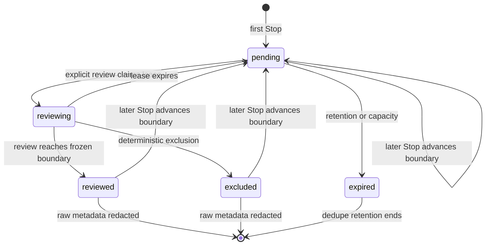

# Skill Evolver Session Capture Amendment Design

**Status:** Approved under the user's m1 automatic-approval delegation

**Date:** 2026-07-28

**Requirement:** `GATE-01`

**Supersedes:** Turn-level capture and symmetric data-root access assumptions in
`2026-07-26-skill-evolver-design.md`

## 1. Purpose

Phase 1 proved that the central `Stop` Hook works on Codex CLI and Desktop, but
four product-gate checks failed:

- the Hook could write the fixed global data root while the default
  skill-launched process could not;
- the CLI transcript identity changed before inspection;
- Desktop turn identifiers did not form a contiguous record span.

Phase 2 changes the contract from turn capture to bounded session capture and
from symmetric root access to least-privilege asymmetric access. It then reruns
the probe on CLI and Desktop. Runtime Queue implementation remains blocked until
the amended report is `PASS`.

## 2. Scope

Phase 2 delivers:

1. this design amendment;
2. a session-level feasibility probe and deterministic tests;
3. two independent real-session observations for CLI and Desktop;
4. sanitized access and session-structure fixtures;
5. a new report that references, but does not overwrite, the Phase 1 report;
6. a revised Runtime Queue plan after the amended gate passes.

Phase 2 does not build the production SQLite queue, review model workflow,
candidate inbox, evaluation, apply, or undo.

## 3. Decisions

### 3.1 One global inbox

The production data root remains a canonical directory outside every workspace:

```text
<codex-home>/skill-evolver/
```

This preserves one improvement inbox across all captured main Codex sessions.
The installation resolves the path once and records the absolute canonical path;
runtime environment variables cannot redirect it.

The data root remains mode `0700`; private files remain mode `0600`. Symlinks,
wrong-owner paths, group-writable paths, and world-writable paths fail closed.

### 3.2 Asymmetric access

The old gate incorrectly required Hook and skill processes to have identical
default read/write access. The amended contract separates automatic capture from
explicit inbox mutation.

| Actor and action | Default access |
| --- | --- |
| `Stop` Hook | Read and write the global root |
| Ordinary Codex task | No queue mutation |
| `$skill-evolver status` | Read-only |
| `$skill-evolver review`, `defer`, `reject`, maintenance | Exact-command, explicit write approval for the global root |
| Apply, purge, undo | External TTY plus complete digest/hash approval |

No permanent writable-root grant is required. An explicit mutating invocation
may run after the user approves the exact command or may emit an exact command
for a user-controlled terminal. Approval is scoped to that invocation; it does
not make the global inbox writable by later ordinary tasks.

The user's development-time instruction to auto-approve work through m1 does not
change the shipped runtime approval model.

### 3.3 Session identity

`turn_id` is optional diagnostic metadata and is not a queue key or transcript
boundary.

The durable pseudonymous identity is:

```text
session_key = HMAC-SHA256(identity_key, "session\0" || session_id)
```

The raw `session_id` may be retained only while the review item remains within
the raw-metadata TTL. It is removed after 30 days. `session_key` may remain for
180 days to prevent duplicate capture and duplicate evidence counting.

Only the main `Stop` Hook is registered. `SubagentStop` remains excluded.

### 3.4 One active row per session

Repeated Stops do not append one row per turn. They converge on one active
session row.

The row tracks:

- `session_key`;
- current `generation`;
- current `transcript_epoch`;
- `status`;
- first and last Stop timestamps;
- latest safe transcript locator and stat;
- `observed_boundary`;
- `reviewed_boundary`;
- the boundary frozen by an active review lease;
- raw-metadata and dedupe expiry;
- error or exclusion code.

While a row is `pending`, additional Stops only advance the latest safe observed
boundary within the same transcript epoch. They do not create additional work
items.

### 3.5 Incremental generations

Review freezes a generation:

```text
review_from = reviewed_boundary
review_to   = observed_boundary
```

New Stops may advance `observed_boundary` while review is running, but cannot
change `review_to`. After successful or explicit exclusion handling,
`reviewed_boundary` advances to `review_to`.

If `observed_boundary > reviewed_boundary`, the same session returns to
`pending` as the next generation. Otherwise it becomes `reviewed`.

Candidate evidence remains unique by candidate fingerprint, `session_key`, and
signal type. Reopening a session therefore does not falsely count the same
session as a second independent occurrence.

## 4. State Model



An expired lease returns the row to `pending` without advancing
`reviewed_boundary`. A failed adapter does not guess a boundary. It records a
bounded error and follows the configured retry or exclusion policy.

## 5. Stop Capture Contract

The Hook reads only:

| Field | Use |
| --- | --- |
| `hook_event_name` | Require `Stop` |
| `session_id` | Compute `session_key` |
| `transcript_path` | Record a later-review locator |
| `cwd` | Apply capture scope and diagnostics |
| `turn_id` | Optional diagnostic shape only |

The Hook:

1. validates bounded stdin and field sizes;
2. validates a current-user regular transcript file under a fixed transcript
   root;
3. records device, inode, size, and mtime;
4. upserts the latest boundary for `session_key`;
5. emits no stdout or stderr, performs no network call, and exits `0`;
6. falls back to the existing bounded atomic spool contract when the store is
   busy.

The production capture scope is all main sessions unless an explicit
`exclude_roots` entry matches the canonical `cwd`. A pause setting disables
capture without uninstalling the Hook. Phase 2 only probes this contract; the
production configuration and SQLite upsert are Phase 3 work.

## 6. Transcript Resolution and Review Boundary

### 6.1 Locator validation

Review never trusts a path supplied by transcript content. It resolves the
Hook-recorded locator under the installation's fixed transcript roots.

The preferred binding is the same current-user regular file identity recorded
by the Hook. If the original path moved, a bounded lookup may accept a file with
the same device and inode under an allowed transcript root.

If device/inode identity changed, the adapter may accept the file only when the
amended real-surface probe discovers a stable embedded `session_id` path and the
value matches the raw session identifier. If neither binding is available, the
item fails closed as `session_binding_unavailable`.

Byte cursors are comparable only within one transcript identity. A same-inode
rename stays in the current `transcript_epoch`. An accepted different-inode file
increments `transcript_epoch`, resets `reviewed_boundary` to zero, and reviews
the new bounded prefix. Candidate evidence uniqueness by `session_key` prevents
that defensive reread from counting as a second independent session. A smaller
or replaced file without embedded session binding fails closed instead of
resetting the cursor.

The probe records only sanitized pointer paths and binding modes, never raw
session identifiers, transcript paths, or transcript text.

### 6.2 Frozen prefix

The latest completed Stop supplies `observed_boundary`. Review opens the
resolved file with `O_NOFOLLOW`, validates the open descriptor, and freezes
`review_to <= observed_boundary`. It reads no byte after `review_to`, even if the
session continues during review.

The exact prefix must consist of complete JSONL records. Partial records,
replacement during read, unsupported encoding, oversized input, or changed
binding fail closed.

### 6.3 Session-level provenance

The adapter no longer:

- searches for a `turn_id`;
- requires a contiguous turn span;
- assumes CLI and Desktop expose identical pointer paths.

For each surface, the probe must discover stable user/assistant provenance
across two independent sessions. A binding may use stable embedded session
identity or stable file identity as defined above.

For later generations, review selects records after `reviewed_boundary` and may
include a bounded preceding context window for attribution. Only the new
generation contributes new evidence. If the delta or required context exceeds
the configured byte or record limit, it is excluded as `oversized_session`
rather than silently truncated.

## 7. Queue Management Contract

The production defaults inherited by the revised Runtime Queue plan are:

| Limit | Value |
| --- | ---: |
| Review batch | 5 sessions |
| Pending capacity | 200 sessions |
| Pending retention | 14 days |
| Raw metadata TTL | 30 days |
| Session-key dedupe retention | 180 days |
| Spool | 200 files or 10 MiB |
| Candidate creation | 1 per session, 3 new fingerprints per batch |

Turn-count limits and `turn_count` metrics are removed. Status reports session
and generation counts.

`$skill-evolver status` is transcript-free and mutation-free. It reports:

- pending sessions and generations;
- oldest pending age;
- active or expired leases;
- excluded, expired, and binding-failure counts;
- spool count, bytes, and cumulative overflow;
- last successful Hook timestamp;
- raw-metadata cleanup health.

## 8. Amended Feasibility Probe

### 8.1 Immutable Phase 1 evidence

The following files remain unchanged:

```text
docs/feasibility-report.json
docs/feasibility-report.md
skills/skill-evolver/tests/fixtures/*-cli.structure.json
skills/skill-evolver/tests/fixtures/*-desktop.structure.json
```

Phase 2 uses schema-v2 fixture names and report names. The new report includes
the SHA-256 of the Phase 1 JSON report and identifies it as the predecessor.

### 8.2 Access fixture

The access probe separates observations that the old fixture conflated:

- Hook global-root read;
- Hook global-root write;
- skill default read;
- skill default write, expected to be denied;
- skill explicit scoped write;
- sanitized error codes.

The access contract passes when Hook read/write, skill default read, and skill
explicit scoped write succeed, while default skill write remains denied.

### 8.3 Session fixture

Each surface contributes two independent real sessions. A sanitized fixture
records:

- distinct session observations;
- stable Stop field shape;
- JSONL support;
- binding mode and sanitized pointer paths;
- user/assistant provenance pointer paths;
- complete-prefix validation;
- boundary and suffix behavior;
- absence of turn-span requirements;
- error codes only from a fixed allowlist.

### 8.4 Gate checks

The amended gate evaluates these checks independently for CLI and Desktop:

1. Stop session contract;
2. Hook global-root read/write;
3. default skill read and default-write denial;
4. explicit scoped skill write;
5. bounded session transcript support;
6. stable provenance and session binding;
7. no read after the frozen boundary.

Every check on both surfaces must pass. A missing, malformed, aliased,
symlinked, duplicated, mislabeled, or privacy-unsafe fixture fails closed.

The outputs are:

```text
docs/feasibility-report-v2.json
docs/feasibility-report-v2.md
```

The report decision is deterministic. It contains no raw session ID, transcript
path, transcript text, prompt, model output, token, or credential.

## 9. Failure Handling

- If default skill read fails on either surface, Phase 2 remains blocked.
- If explicit scoped write cannot be completed, Phase 2 remains blocked; a
  permanent writable-root grant is not silently substituted.
- If CLI transcript relocation or binding cannot be proved, Phase 2 remains
  blocked.
- If a surface lacks stable session provenance, no pointer path is guessed.
- A failed rerun creates a new sanitized attempt report; it does not edit a
  previous result into `PASS`.
- Phase 3 cannot start until the authoritative schema-v2 report is `PASS`.

## 10. Test Strategy

Deterministic tests cover:

- HMAC session identity and duplicate Stop convergence;
- optional `turn_id`;
- observed/reviewed/frozen boundary transitions;
- Stop during an active review lease;
- lease expiry without cursor advancement;
- session reopening after later content;
- candidate evidence uniqueness across generations;
- same-inode relocation under an allowed root;
- different-inode epoch reset only with matching embedded session identity;
- rejected symlink, owner, root escape, and changed identity;
- embedded session binding when discovered by a real-surface probe;
- exact-prefix JSONL parsing and suffix non-read;
- noncontiguous turn IDs being irrelevant;
- oversized or partial session failure;
- separated access read/write results;
- schema-v2 fixture privacy and deterministic gate behavior;
- predecessor-report digest and immutable Phase 1 artifacts.

Real integration evidence requires two independent sessions per surface and the
exact default-versus-explicit access modes described above.

## 11. Downstream Amendments

After a schema-v2 `PASS`, the Runtime Queue plan must be rewritten before
execution. At minimum it must:

- replace `event_key(session_id, turn_id)` with `session_key`;
- remove required `turn_id`;
- add observed, reviewed, and frozen session boundaries plus generation fields;
- use a session upsert instead of one insert per Stop;
- express capacity, retention, status, and batch limits in sessions;
- use explicit scoped approval for mutating skill commands;
- preserve the global data root and external-TTY Apply/Undo boundaries.

Review and Quality plans must count independent session evidence, not repeated
generations of one session, when evaluating recurrence or quality thresholds.

## 12. Completion Criteria

Phase 2 is complete only when:

1. this amendment and its implementation plan are committed;
2. deterministic probe tests pass;
3. CLI and Desktop each provide two independent sanitized session fixtures;
4. both access matrices satisfy the asymmetric contract;
5. `feasibility-report-v2.json` and Markdown both say `PASS`;
6. the report references the immutable Phase 1 report digest;
7. the Runtime Queue plan is revised to the approved session contract;
8. GSD records `GATE-01` and Phase 2 as complete.
