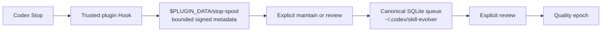

# Skill Evolver Plugin-Data Spool Amendment

**Status:** Approved under the user's m1 automatic-approval delegation

**Date:** 2026-07-30

**Requirements:** `CAPT-01`, `QUALITY-01`

**Supersedes:** The production assumption that a sandboxed `Stop` Hook can
write the canonical global data root in
`2026-07-28-skill-evolver-session-capture-amendment-design.md`

## 1. Problem

The installed `0.1.0` plugin observed a fresh Desktop session but did not add it
to the queue. The same bounded `Stop` payload produced one pending session when
the runtime was placed under `/private/tmp`, while an actual write transaction
against the canonical database failed with `SQLITE_READONLY`.

The parser, session identity and queue upsert therefore work. The invalid
assumption is the write boundary: current Codex runs the plugin Hook under the
task sandbox, so the Hook can read
`/Users/igyeongseob/.codex/skill-evolver` but cannot write its database or its
co-located fallback spool. `enqueue-stop` intentionally suppresses exceptions,
which made the loss silent.

Codex provides `$PLUGIN_DATA` as the writable persistent directory for an
installed plugin. Automatic capture must use that boundary.

## 2. Scope

This amendment restores automatic session capture without changing candidate
generation, quality thresholds, evaluation, apply or undo.

It delivers:

1. a spool-only Hook path under the exact `$PLUGIN_DATA` directory;
2. explicit import from that ingress spool into the existing canonical SQLite
   queue;
3. read-only status for the ingress spool;
4. deterministic tests for path binding, privacy, boundedness, import and
   idempotency;
5. a plugin patch release and one real Desktop capture check.

It does not move the canonical database, automatically run review, infer human
labels, or enable any post-Phase-5 capability.

## 3. Options

### 3.1 Selected: split automatic ingress from the canonical queue

The Hook writes a bounded HMAC-authenticated spool under `$PLUGIN_DATA`.
Explicit maintenance or review imports it into the existing canonical database.

This reuses the current spool payload, locking, size limits, validation and
idempotent upsert. It adds no dependency and leaves the approval boundary for
queue mutation unchanged.

### 3.2 Rejected: move the whole runtime to `$PLUGIN_DATA`

This would make the Hook's direct SQLite path simple, but it would require a
database and identity-key migration and would make ordinary skill commands
depend on plugin-data access that is not their documented persistence contract.

### 3.3 Rejected: grant the Hook global-root write access

This depends on host sandbox exceptions rather than the plugin storage
contract. It also gives an automatic lifecycle callback broader write access
than it needs.

## 4. Architecture



There are two storage roles:

- **Ingress spool:** automatic, append-only capture owned by the plugin Hook.
- **Canonical runtime:** explicit mutation, dedupe state, review state,
  candidates and quality epochs.

Only the spool location changes. The canonical identity key still signs
`session_key` and each spool payload, so an untrusted file placed in plugin data
cannot become a queue item.

## 5. Command and Path Contract

The Hook command passes the host-provided directory explicitly:

```text
/usr/bin/python3 -I "$PLUGIN_ROOT/skills/skill-evolver/scripts/evolver.py" \
  enqueue-stop \
  --installation "/Users/igyeongseob/.codex/skill-evolver/installation.json" \
  --plugin-data "$PLUGIN_DATA"
```

`--plugin-data` is optional only for backward-compatible direct tests and
legacy invocations. When supplied:

1. it must be a non-empty absolute canonical path;
2. it must equal the trusted plugin-data path pinned in the plugin runtime
  reference and the canonical installation's expected plugin-data relation;
3. its existing components must not be symlinks;
4. the directory and dedicated `stop-spool/` child must be owned by the
   current user with mode
   `0700`;
5. the Hook uses spool-only capture and never opens the canonical database for
   writing.

`status` and explicit mutating commands resolve the same pinned plugin-data
path without relying on an ambient environment variable. The CLI must not
accept an arbitrary import directory: import deletes consumed or invalid spool
files, so an unbound path would be an unsafe deletion surface.

Legacy installations and isolated tests that do not configure plugin data keep
using the co-located canonical spool. No database schema migration is required.

## 6. Data Flow

### 6.1 Automatic capture

The Hook:

1. loads the read-only installation, config and identity key;
2. reads at most 65,536 bytes from stdin;
3. validates the `Stop` envelope and transcript locator without reading
   transcript content;
4. derives the HMAC session key;
5. converges the latest event for that `session_key` into one canonical signed
   JSON payload under `$PLUGIN_DATA/stop-spool`;
6. exits `0` without stdout, stderr, model calls or network access.

The existing limits remain 200 files and 10 MiB, but the primary ingress file
count represents distinct session keys rather than Stop deliveries. Under the
existing spool lock, an older delivery cannot replace a newer signed payload;
a newer delivery atomically replaces only the same session-key file. This
prevents a long-running session from exhausting the whole ingress capacity.
Lock contention, capacity overflow and invalid filesystem state remain bounded
and never block the completed task.

### 6.2 Explicit import

`maintain` is the only ingress import entry path:

1. open the canonical database with the existing explicit approval;
2. scan the pinned ingress spool within existing entry and byte bounds;
3. verify owner, mode, file identity, HMAC, expiry and transcript-root fields;
4. sort verified events by captured timestamp and filename;
5. upsert them through the existing session convergence logic;
6. delete only the exact verified spool inode after a successful upsert;
7. retain or discard malformed/raced entries according to the existing spool
   contract.

Repeated import or repeated Stops for one session remain idempotent.

## 7. Status and Failure Semantics

Read-only `status` reports the active ingress spool using the existing `spool`
object. It does not add spool files to `pending_sessions`, because multiple
files may converge to one session after import.

`last_hook_success_at` continues to mean “accepted into the canonical queue.”
Before import, `spool.verified_files >= 1` is the durable proof that automatic
capture succeeded; the raw spool count is diagnostic inventory only. This
avoids mutating the canonical database merely to report Hook health.

If plugin data is absent, status reports an empty spool plus a bounded
availability indicator; it does not create directories. The Hook may create
its exact private `stop-spool/` child under an already host-provided plugin-data
directory. It must not create or chmod arbitrary ancestors.

The Hook remains best effort. A capture failure cannot fail the user's task,
but status must make accumulated spool, overflow or unavailable storage
visible.

## 8. Privacy and Security

The ingress payload contains only the metadata already allowed by the Phase 3
spool contract: raw session identifier within its TTL, optional diagnostic turn
identifier, canonical cwd, transcript locator and file stat. It never contains
transcript records, prompts, responses or proposed skill changes.

Required boundaries:

- exact pinned plugin-data equality and canonical-installation relation before
  any Hook write or import deletion;
- a dedicated `stop-spool/` child so unrelated plugin JSON is never scanned or
  deleted;
- current-user ownership and private modes;
- no symlink traversal and inode-bound deletion;
- existing HMAC verification with the canonical identity key;
- existing file, byte, scan, time-skew and retention bounds;
- no fallback from a rejected plugin-data path to an arbitrary or global path;
- no automatic review, candidate application or quality labeling.

## 9. Verification

The minimum automated proof is:

1. canonical database writes denied while a writable plugin-data spool still
   captures one event;
2. the Hook command includes quoted `$PLUGIN_DATA` and uses spool-only mode;
3. an unpinned, relative, symlinked, wrong-owner or non-private path fails
   closed;
4. ingress payloads contain no transcript text;
5. explicit maintenance imports a valid event exactly once and removes only
   its verified inode;
6. repeated Stops for one session converge on one ingress file and preserve
   the newest observation;
7. status reports HMAC/schema-verified ingress separately from raw inventory
   without mutating either store;
8. the existing capture, review, quality and full suites remain green.

The production proof is one new Desktop task after installing the patch and
trusting the changed Hook. Before import, status must show
`spool.verified_files >= 1`; raw `spool.files` is diagnostic inventory, not
capture proof. After explicit maintenance, it must show a pending canonical
session and an empty ingress spool.

## 10. Rollout and Gate Effect

1. implement and verify the patch in the source repository;
2. release it as `0.1.2`;
3. reinstall or refresh the local plugin;
4. review and trust the changed Hook command;
5. run one fresh meaningful Desktop task;
6. confirm capture, then import it explicitly;
7. terminalize the empty `Q-001` as `quality_provenance_drift`;
8. open `Q-002` with the exact `Q-001` terminal report digest as its
   predecessor;
9. continue real-session collection in `Q-002`.

The missed `0.1.0` session is diagnostic evidence only and is not reconstructed
or counted in either epoch. Changing `evolver.py` changes the pinned
`runtime_digest`, so preserving `Q-001` would violate the quality provenance
contract even though it has no observations. Phase 5 remains `COLLECTING`; this
amendment restores its input path and does not bypass the ten-distinct-session
quality gate.
