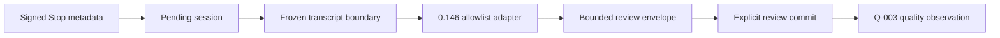

# Skill Evolver Codex 0.146 Transcript Adapter Amendment

**Status:** Approved under the user's m1 automatic-approval delegation

**Date:** 2026-07-31

**Requirements:** `REVIEW-01`, `QUALITY-01`

**Amends:** `2026-07-29-skill-evolver-session-review-inbox-design.md`
and `2026-07-30-skill-evolver-session-quality-gate-design.md`

## 1. Problem

The installed `0.1.2` plugin captured real Desktop sessions, but two explicit
review claims exported no sessions:

- batch 1 terminally excluded five sessions as
  `unsupported_transcript`;
- batch 2 terminally excluded one session as
  `unsupported_transcript` and two as `oversized_model_export`;
- both batches correctly recorded zero completed sessions, candidates and
  quality observations.

The queue and plugin-data ingress paths work. The failure occurs after a
pending session is claimed, while its frozen transcript is classified.

Codex documents `transcript_path` as a convenience whose format is not a
stable Hook interface. The installed `codex-cli 0.146.0` rollout schema has
known `ResponseItem` variants that the adapter does not classify, including
`additional_tools`, `local_shell_call`, `custom_tool_call`,
`web_search_call`, `compaction`, and `context_compaction`. The adapter
currently treats any unclassified delta `response_item` as terminally
unsupported. A normal tool-using session can therefore be excluded before its
user and assistant messages are reviewed.

## 2. Scope

This amendment makes the existing transcript adapter compatible with the
known Codex `0.146.0` rollout schema while preserving its fail-closed
boundary.

It delivers:

1. an exact allowlist for non-evidence call and control metadata;
2. bounded text extraction from the documented structured tool-output shape;
3. deterministic regression tests modeled on Codex `0.146.0`;
4. a transcript-adapter contract and digest change;
5. plugin patch release `0.1.3`;
6. invalidation of the empty `Q-002` epoch and a fresh `Q-003` cohort.

It does not make arbitrary future transcript records acceptable, recover
already excluded generations, reduce the ten-session quality threshold,
infer labels, or authorize Phase 6.

## 3. Source Contract

The compatibility baseline is the installed Codex release:

- local runtime: `codex-cli 0.146.0`;
- release source:
  `openai/codex` tag `rust-v0.146.0`,
  `codex-rs/protocol/src/models.rs`;
- outer rollout source:
  `openai/codex` tag `rust-v0.146.0`,
  `codex-rs/protocol/src/protocol.rs`.

The release schema is used only to define tests and classification. Runtime
review remains local, bounded and network-free. The adapter does not fetch a
schema or trust a transcript-declared version.

## 4. Options

### 4.1 Selected: exact release-shaped allowlist

Classify the known `0.146.0` call/control variants explicitly. Continue to
reject unknown response items and unsupported evidence-bearing payloads.

This is the smallest change that restores ordinary tool-using sessions
without weakening attribution safety.

### 4.2 Rejected: ignore every unknown response item

This would tolerate future Codex additions but could silently discard a new
message or tool-result form. A review could then propose an improvement from
incomplete evidence.

### 4.3 Rejected: replace transcript parsing with app-server reads

A public projection may become a better long-term source, but changing the
capture/review transport is a separate subsystem and does not fit the Phase 5
compatibility repair.

## 5. Classification Contract

The adapter keeps the current outer rollout classification. Inside
`response_item`, it applies this exact contract:

| Item | Action | Rationale |
| --- | --- | --- |
| `message/user` | export text | direct user signal |
| `message/assistant` | export text | assistant behavior |
| `function_call_output` | export supported text | tool result evidence |
| `custom_tool_call_output` | export supported text | dynamic tool result evidence |
| `agent_message` | ignore | inter-agent content is not direct user evidence |
| `reasoning` | ignore | private model reasoning |
| `function_call` | ignore | call metadata; result is handled separately |
| `custom_tool_call` | ignore | call metadata; result is handled separately |
| `local_shell_call` | ignore | call metadata |
| `tool_search_call` | ignore | tool-discovery metadata |
| `tool_search_output` | ignore | tool-definition metadata |
| `additional_tools` | ignore | tool-definition metadata |
| `web_search_call` | ignore | hosted call metadata, not page content |
| `compaction` | ignore | encrypted context-control record |
| `context_compaction` | ignore | encrypted context-control record |
| `compaction_trigger` | ignore | request-control record |
| `image_generation_call` | reject | combined multimodal result is not safely reviewable as text |
| any other item | reject | unknown evidence semantics |

Developer and system messages remain ignored. Unknown outer rollout records
remain ignored only when they do not have an evidence shape; an
evidence-shaped unknown record remains terminally unsupported.

## 6. Structured Tool Outputs

Codex `0.146.0` serializes `function_call_output.output` and
`custom_tool_call_output.output` as either:

1. a string; or
2. an array of tagged content items.

The adapter accepts a string exactly as before. For an array:

- `input_text` contributes its validated, owner-token-redacted text;
- `encrypted_content` contributes no text;
- `input_image`, `input_audio`, an unknown tag, a malformed item, or a
  non-list/non-string body makes the session terminally
  `unsupported_transcript`.

This avoids silently converting multimodal evidence into an incomplete text
review. Existing transcript byte, record, UTF-8, evidence-shape and envelope
limits continue to apply.

## 7. Data Flow and Failure Semantics

The queue, claim and commit lifecycle does not change:

Known call metadata can no longer terminate the session. Unsupported
multimodal or unknown response items still terminally exclude only that
generation. Aggregate model-envelope overflow remains a separate bounded
exclusion and is not reclassified as an adapter failure.

No transcript text is added to status, audit, quality metadata or repository
reports.

## 8. Provenance and Rollout

Changing the recognized item set and structured-output behavior changes the
transcript-adapter contract and digest. The contract format advances from
`current-codex-jsonl-v1` to `codex-rollout-jsonl-v2`, and its `recognized`
section lists every supported and ignored `0.146.0` item.

The plugin version advances to `0.1.3`. Source, packaged cache and installed
runtime digests must match before production use.

`Q-002` has no observations, candidates or labels, but it is still bound to
the old adapter digest. After installing `0.1.3`:

1. explicitly terminalize `Q-002` as provenance-drift `INVALID`;
2. materialize and verify its aggregate terminal report if required by the
   release workflow;
3. explicitly open `Q-003` with the exact `Q-002` report digest;
4. collect and explicitly review at least ten new real distinct sessions;
5. seal, externally label and gate `Q-003`.

Neither the eight excluded generations nor synthetic regression fixtures count
toward `Q-003`.

## 9. Verification

Automated proof must include:

1. a production-shaped `0.146.0` transcript with `custom_tool_call`,
   `custom_tool_call_output`, user and assistant messages exports normally;
2. every selected call/control variant is ignored in a delta without hiding
   adjacent messages;
3. structured text tool output is exported and owner tokens are redacted;
4. encrypted structured output is omitted;
5. structured image/audio, malformed content, `image_generation_call`, and an
   unknown response item remain terminally unsupported;
6. the adapter contract lists the exact behavior and its digest changes;
7. Review, capture, quality and full suites remain green;
8. compile and privacy scans remain clean;
9. independent specification and security/privacy reviews approve the diff.

Production proof requires a fresh post-install direct Desktop session whose
tool-using transcript reaches a `ready` review claim and whose explicit review
commit adds exactly one `Q-003` observation. This proves mechanics only; Phase
5 still requires the complete ten-session cohort and external labels.

## 10. Success Criteria

- Ordinary Codex `0.146.0` tool-call metadata no longer excludes an otherwise
  supported session.
- Unknown and multimodal evidence stays fail-closed.
- No automatic review, label, evaluation, preparation, apply or skill write is
  introduced.
- `Q-002` is never reused under changed provenance.
- Only a real externally attested `Q-003` PASS can unlock Phase 6.
