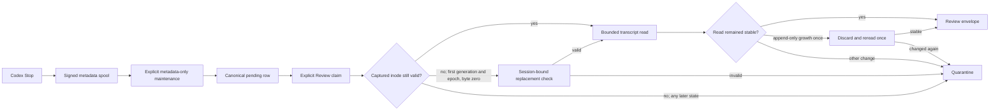

# Skill Evolver Desktop Transcript Rebinding Amendment

**Status:** Approved by the user on 2026-08-06

**Date:** 2026-08-06

**Requirements:** `REVIEW-01`, `QUALITY-01`

**Amends:**

- `2026-07-28-skill-evolver-session-capture-amendment-design.md`
- `2026-07-29-skill-evolver-session-review-inbox-design.md`
- `2026-07-30-skill-evolver-plugin-data-spool-design.md`
- `2026-07-31-skill-evolver-codex-0146-transcript-adapter-design.md`

## 1. Problem

The plugin-data spool captures a signed transcript locator at the Codex
`Stop` boundary. Explicit maintenance later imports that locator without
opening the transcript, and Review freezes it before reading the bounded
generation.

That separation is correct for sandboxing and privacy, but it assumes the
captured file identity remains usable until Review. Production Desktop
evidence disproves that assumption:

- 58 pending generations were quarantined as `transcript_changed`;
- a metadata-only audit found 39 stored paths now refer to a different inode;
- 19 paths retain the same inode and have grown since the captured boundary;
- Review batches 12 through 23 exported no usable sessions from those rows;
- one separate generation was terminally excluded as
  `unsupported_transcript` and is not part of this locator repair.

No transcript body was read to produce these counts. The audit compared only
stored locator metadata with current filesystem metadata.

The common failure path is:

1. `Stop` captures path, size, mtime, device and inode.
2. The signed spool preserves that exact locator.
3. Desktop finishes or replaces the rollout file after `Stop` returns.
4. Maintenance imports the now-stale locator as an accepted new row.
5. Review requires the original device and inode and returns
   `transcript_changed`.
6. The row remains `pending`, but ordinary claim excludes rows whose
   `error_code` is set.

This makes the queue appear full while its claimable subset is nearly empty.
The work was not deleted; it was retained in a retryable-but-ineligible
quarantine state.

## 2. Goals

This amendment must:

1. accept a legitimate Desktop file replacement for a wholly unreviewed
   session only after binding the replacement to the signed session identity;
2. preserve the signed numeric `Stop` upper bound and never read current-file
   offsets at or beyond `frozen_to` as part of that event;
3. tolerate one bounded append race without accepting an unstable read;
4. keep later-generation cursor integrity strict;
5. distinguish total pending, claimable and quarantined inventory in
   read-only status;
6. preserve transcript privacy, explicit Review and user-only quality labels;
7. change quality provenance and validate the repair in a new epoch.

## 3. Non-goals

This amendment does not:

- read transcript content during automatic `Stop` capture or maintenance;
- store transcript text, excerpts or byte copies in the spool, database,
  status output or repository;
- automatically review, label, apply or undo a candidate;
- bulk-revive the 58 already quarantined generations without a strictly newer
  signed Stop for the same session;
- accept an inode replacement after any byte cursor has been reviewed;
- make unknown evidence-bearing rollout records acceptable;
- repair the separately observed `unsupported_transcript` generation;
- reduce the ten-distinct-session quality threshold;
- add a database server or external dependency.

## 4. Options

### 4.1 Selected: never-reviewed convergence plus Review-time rebinding

Review may use the current file at the exact captured path when the frozen
claim is the first queue generation in the first transcript epoch, starts at
byte zero, and the current file's initial `session_meta.payload.session_id`
binds to the signed session key.

When a strictly newer signed Stop arrives before Review, metadata-only upsert
may instead adopt that locator for the same never-reviewed first generation.

This is the smallest viable boundary change. Review already opens and parses
the transcript, so binding at this point adds no new transcript-reading
surface. The original `Stop` boundary remains authoritative.

### 4.2 Rejected: refresh the locator during maintenance

Maintenance could re-stat the current path before upsert. A stat alone cannot
bind a replacement to the captured session, while reading `session_meta`
during import would break the metadata-only import contract. It would also
mix queue ingestion with transcript interpretation.

### 4.3 Rejected: preserve strict inode identity and require another Stop

A later Stop can provide a new signed locator, and the selected design safely
adopts it for a never-reviewed row. Under the existing strict rule, however,
that same event becomes `pending_epoch` and remains unclaimable without a
separate epoch-adoption mechanism. A completed one-turn Desktop task may also
never produce the later Stop. Preserving the strict rule would therefore keep
both one-turn and multi-turn recovery operationally unreliable.

### 4.4 Rejected: copy or hash the transcript at Stop

Copying the file would persist private transcript content in ingress storage.
Hashing the entire prefix on every Stop would make the automatic Hook cost
grow with session length and violate its bounded, fast-path role. A bounded
sample would not prove the unchanged middle of the frozen prefix.

## 5. Architecture

The Hook command and maintenance transcript-reading boundary do not change.
The amendment changes metadata-only queue convergence for a strictly newer
Stop on a never-reviewed row, the explicit Review adapter, its read-only
status projection and provenance metadata.

## 6. First-generation Rebinding Contract

### 6.1 Newer Stop convergence before Review

This section narrowly supersedes the 2026-07-28 capture amendment's rule that
every accepted different-inode event requires embedded-session adoption and a
new transcript epoch. The exception applies only to the never-reviewed state
defined below; every other different-inode event retains the earlier rule.

A strictly newer signed Stop may replace the stored locator without entering
`pending_epoch` only when the existing row satisfies every condition below:

1. `status == pending`;
2. `generation == 1`;
3. `transcript_epoch == 0`;
4. `reviewed_boundary == 0`.

The newer event is already bound to the same HMAC `session_key` by spool
verification. Upsert adopts its metadata locator, keeps `binding_status` as
`accepted`, clears a retryable transcript locator error, and preserves the
row's original pending age. It does not open or parse the transcript.

Any later generation, later transcript epoch, nonzero reviewed boundary or
active Review lease keeps the existing `pending_epoch` and
`transcript_rebind_required` behavior. This rule makes the multi-turn flow
`Stop A -> maintain -> replacement -> Stop B -> maintain -> Review`
claimable without weakening a committed cursor.

### 6.2 Review-time eligibility

A mismatched current inode may be rebound only when every condition below is
true:

1. `generation == 1`, `transcript_epoch == 0` and `frozen_from == 0`. This
   excludes a cursor reset performed by later transcript-epoch adoption as
   well as every later queue generation.
2. The current path is exactly `frozen.locator.path`, the canonical path
   recorded in the frozen claim.
3. The path remains inside an installed transcript root.
4. The path and opened descriptor are not symlinks.
5. The descriptor refers to a regular file owned by the current user.
6. The current size is at least `frozen_to`.
7. The initial complete JSONL record is a supported `session_meta` record.
8. HMAC derivation from its session ID matches the stored `session_key`.
9. The descriptor satisfies the bounded stability rules in Section 7.

The adapter does not search all transcript roots for a different inode that
merely declares the same session ID. Existing relocation remains limited to
the original inode. Replacement rebinding is therefore exact-path only.

### 6.3 Boundary preservation

Rebinding changes only the descriptor identity used for this read. It does
not change:

- `frozen_from` or `frozen_to`;
- the signed spool payload;
- the frozen claim contract or its locator digest;
- the database cursor;
- evidence eligibility rules.

Bytes at or beyond `frozen_to` remain out of scope even when the replacement
file is larger. The replacement's current size must never become the captured
`Stop` boundary.

This is a numeric byte-coordinate guarantee, not proof that the replacement's
prefix is byte-for-byte identical to the inode captured at `Stop`. A
same-session rewrite or compaction can change bytes below `frozen_to`. The
design accepts that risk only for a never-reviewed first generation in the
current-user Codex transcript root; proving historical prefix identity would
require the rejected copy or full-prefix-hash designs.

### 6.4 Later generations remain strict

When any first-generation condition is false, a device or inode replacement
remains `transcript_changed`. A later generation, later transcript epoch or
nonzero cursor assumes prior state that a matching session ID alone cannot
prove.

Existing `pending_epoch` and `transcript_rebind_required` behavior remains
fail-closed. Automatic epoch adoption is outside this amendment.

## 7. Bounded Read-race Recovery

The adapter continues to read through one no-follow descriptor and never past
`frozen_to`.

If the before/after stat tuple changes only because the same device and inode
grew while the first read was in progress:

1. discard the complete first parse and every record derived from it;
2. close the descriptor;
3. reopen the same path and require the device and inode selected by the first
   attempt; the retry cannot perform a fresh replacement rebind;
4. repeat the entire bounded read exactly once;
5. accept only when the second read remains stable.

There is no sleep, polling loop, network access or model call. The maximum
transcript I/O is two bounded read attempts.

The adapter does not retry when it observes:

- device or inode change after binding;
- shrinkage below `frozen_to`;
- same-size mtime change;
- symlink, type or owner failure;
- incomplete JSONL at the frozen boundary;
- open, stat or read instability that cannot be classified as same-inode
  growth.

Those cases retain the existing retryable quarantine semantics. A second
same-inode growth during the retry is also quarantined.

## 8. Status and Queue Semantics

Read-only `status` keeps `pending_sessions` for backward compatibility and
adds:

- `claimable_sessions`: pending, accepted-binding rows with no error and a
  non-empty unreviewed boundary;
- `quarantined_sessions`: every pending row that is not claimable;
- `quarantined_by_error`: counts grouped by sanitized stored error code, plus
  fixed `binding_pending` and `empty_generation` buckets when no stored error
  explains the exclusion.

The projection enforces
`pending_sessions == claimable_sessions + quarantined_sessions`, and the
reason buckets sum to `quarantined_sessions`. A row is counted once even when
both its binding state and stored error make it ineligible. Bucket precedence
is stored error, then `binding_pending`, then `empty_generation`.

The projection must not expose session IDs, transcript paths, inode values,
per-session timestamps, candidate text or transcript content. Existing
aggregate operational timestamps such as `checked_at`,
`last_hook_success_at` and `last_maintenance_at` remain unchanged. Status
opens the database read-only and does not clear or retry any row.

The existing 58 `transcript_changed` rows and one `pending_epoch` row remain
quarantined after installation. They are not bulk-migrated or automatically
requeued. A future strictly newer signed Stop may recover an otherwise
eligible never-reviewed row through Section 6.1, but the old failed generation
does not itself count as a successor quality observation.

## 9. Error Handling

The public compatibility code `transcript_changed` remains valid for existing
rows and callers. This amendment does not require a schema migration.

When the adapter is considering a replacement inode, a missing, malformed or
HMAC-mismatched initial `session_meta` means the replacement cannot be bound.
It is therefore retryable `transcript_changed`: Review leaves
`reviewed_boundary` unchanged and quarantines the row. The replacement's
untrusted header must not terminally consume the signed generation.

When the originally captured inode is still in use, initial-header parsing and
session-binding errors keep their existing partial or terminal semantics.
This distinction is based on binding mode, not on transcript-declared data.

The Review result may use internal, sanitized reason categories while the
stored compatibility code remains unchanged. At minimum, tests must
distinguish:

- captured identity accepted;
- first-generation identity rebound;
- later-generation identity rejected;
- same-inode growth retried successfully;
- second unstable read quarantined;
- missing, partial and unsupported transcript behavior unchanged.

`no_exportable_sessions` remains the correct batch result when every claimed
generation is either retryably quarantined or terminally excluded. Status,
not a changed batch result, provides the clearer inventory view.

## 10. Privacy and Security

The selected design preserves these boundaries:

- automatic Hook ingress remains metadata-only and best effort;
- maintenance remains metadata-only and cannot inspect transcript records;
- replacement content is read only after explicit Review approval;
- only a wholly unreviewed exact-path session can use session-ID rebinding;
- the HMAC session binding is checked before any replacement-derived record
  reaches the model envelope;
- later-generation inode continuity remains strict;
- no raw transcript content is persisted after the bounded Review operation;
- model output, candidate application and quality labels retain their existing
  independent approval gates.

The change intentionally trusts the current-user Codex transcript root to
hold the current representation of an unreviewed session. It does not claim
byte-for-byte continuity with the inode observed at `Stop`. That continuity is
unnecessary at byte zero because no prior cursor exists; Review evaluates the
entire bounded prefix again and validates its session binding.

Consequently, the evidence guarantee after replacement is limited to the
current same-session representation at offsets `[0, frozen_to)`. The adapter
does not claim that every byte in that range existed at the original Stop
instant. This accepted risk is narrower than later-generation rebinding,
which remains prohibited because it could invalidate an already committed
cursor.

## 11. Verification

### 11.1 Deterministic tests

The minimum regression set is:

1. `Stop -> spool -> replace exact path -> maintain -> Review` succeeds for a
   wholly unreviewed session whose `session_meta` matches.
2. The same flow treats a mismatched or malformed replacement session header
   as retryable `transcript_changed`, leaves `reviewed_boundary` unchanged and
   reports the row as quarantined.
3. Replacement rejects a symlink, non-regular file, wrong owner, outside-root
   path or file shorter than `frozen_to`.
4. `Stop A -> maintain -> replace -> Stop B -> maintain` keeps an otherwise
   never-reviewed row accepted and claimable without reading transcript
   content during maintenance.
5. That newer-Stop convergence rejects or keeps `pending_epoch` when the row
   is reviewing, `generation > 1`, `transcript_epoch > 0` or
   `reviewed_boundary > 0`.
6. Review-time replacement rejects when `generation > 1`,
   `transcript_epoch > 0` or
   `frozen_from > 0`, including after transcript-epoch adoption resets the
   cursor to zero.
7. Same-inode suffix growth before Review remains accepted and ignored.
8. Same-inode growth during the first read discards that result and succeeds
   only after one stable reread.
9. Growth during both attempts remains retryably quarantined.
10. Neither original nor rebound reads access bytes beyond `frozen_to`.
11. A matching-session replacement with changed bytes below `frozen_to` is
    accepted only under the first-generation conditions, documenting the
    numeric-boundary risk; the same replacement is rejected for later state.
12. `status` reports total, claimable and quarantined counts, enforces their
   partition and reason-sum invariants, and does not expose private locator
   fields or mutate the database.
13. Existing missing, partial, unsupported, relocation, batch, quality and
    privacy tests remain green.

The implementation must demonstrate the new regression test failing against
the old adapter before the production change is accepted.

### 11.2 Production proof

After release installation:

1. create one fresh one-turn Desktop task that produces a verified spool
   entry;
2. import it through one separately approved maintenance command;
3. run one separately approved Review claim;
4. prove the session exports or is excluded for a content reason other than a
   stale locator;
5. repeat with one multi-turn Desktop task and one CLI task;
6. confirm status separates claimable and quarantined inventory;
7. continue until the successor quality epoch contains ten distinct real
   completed sessions.

Fixtures and repeated generations do not count toward the quality threshold.

## 12. Provenance and Rollout

The transcript-adapter behavior and contract digest change. The patch release
advances the plugin from `0.1.4` to `0.1.5`.

The existing `codex-rollout-jsonl-v2` format name continues to describe the
record layout. Its contract gains explicit `replacement_rebinding` and
`read_stability` objects that bind these decisions:

- exact captured path plus first-generation, first-epoch, zero-cursor
  eligibility;
- strictly newer signed-Stop convergence only for a pending, never-reviewed
  first generation;
- initial `session_meta` HMAC binding;
- preservation of the captured byte boundary;
- at most two complete bounded read attempts;
- strict identity continuity for later generations.

These fields must participate in the immutable transcript-adapter digest.
Changing their values requires another quality-provenance transition even if
the rollout record format name remains unchanged.

`Q-004` is bound to the `0.1.4` adapter and currently has zero completed
sessions, candidates and labels. It must not mix observations across the
change:

1. implement and verify the source patch;
2. terminalize `Q-004` as `INVALID` with
   `quality_provenance_drift` before installing the changed runtime;
3. install `0.1.5` and prove source, cache and installed digest parity;
4. open `Q-005` from the exact immutable `Q-004` terminal report digest;
5. collect only post-open real sessions in `Q-005`;
6. Review explicitly, obtain user-only labels and run the immutable quality
   gate;
7. leave Phase 6 and later mutation capability disabled until `Q-005` is
   terminal `PASS`.

The existing quarantined rows may remain in the database, but their old
generations do not count as `Q-005` observations.

## 13. Acceptance Criteria

The amendment is complete only when:

- the selected replacement and reread tests pass;
- the full existing suite passes;
- no transcript text is added to persistent storage or status output;
- a newer signed Stop can refresh only a never-reviewed first-generation
  locator without transcript reads during maintenance;
- status exposes an accurate claimable subset;
- release `0.1.5` has source/cache/installed parity;
- `Q-004` is immutably terminalized before the runtime change;
- `Q-005` is opened from the exact predecessor digest;
- real Desktop and CLI proof no longer fails solely because the captured
  locator became stale;
- the documented boundary guarantee is limited to current-file offsets below
  `frozen_to`, with historical prefix continuity explicitly out of scope.
